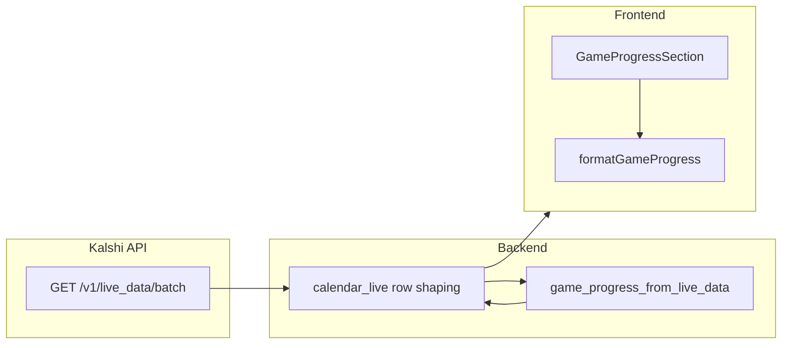

# Feature: calendar-live-live-data-progress-enrichment

_Created: 2026-04-19_

---

## Goal

Enrich `GET /calendar-live` sports event rows so `game_progress` carries normalized score + full `product_details`, live confirmation via Kalshi `widget_status`, regulation completion fraction derived from segment clocks (not naive period÷total), explicit `progress_warning` for halftime/OT/weird states — same caching and `/v1/live_data/batch` cadence as today (no new HTTP route).

---

## Requirements

### Problem Statement

Basketball (and similar) `live_data.details` use `status` values like `inprogress` while `widget_status` is `live`. Backend `_kalshi_in_play` currently requires **both** `status` and `widget_status` to be `"live"`, so `game_progress` is dropped for those events. Clock fields like `period_remaining_time` are not parsed. Frontend cannot rely on a single score schema or full `product_details` inside `game_progress`.

### Goals

- Treat **widget_status === live** as sufficient for computing/attaching `game_progress` (still require usable `details`).
- Parse **`period_remaining_time`** (e.g. `9:51`) into segment remaining seconds for timers and regulation ratio math.
- Expose **normalized scores** `{ home, away }` for all sports from Kalshi aliases (`home_points` / `away_points` / `home_score` / …).
- Pass through **full `product_details`** (JSON-safe subset) on `game_progress`.
- Derive regulation **finished_ratio** using **period index + segment remaining time** (existing clock-sport model), **not** “period 2 of 4 ⇒ 50%” without clock data.
- When in **OT**, **halftime**, or other ambiguous states, **keep showing** progress where possible but set **`progress_warning`** for UI.
- **Home** and **explorer** both show meter + clock/title + live confirmation + warning.

### Non-Goals

- New backend routes or extra Kalshi endpoints beyond existing **`GET /v1/live_data/batch`** keyed by milestone id (same batch as today).
- Changing poll interval on the frontend (still driven by existing explorer store / `useCalendarLiveExplorerPoll`).
- Adding or editing automated tests per user preference (unless existing suite breaks).

### User Stories

- As a user on Home, I see how far regulation has progressed, the live title from `product_details`, and a clear LIVE signal aligned with Kalshi widget state.
- As a user in calendar explorer, I see the same structured progress for consistency.

### Success Criteria

- Basketball (and other in-progress) events with `widget_status: live` receive non-null `game_progress` when batch live_data exists for the milestone.
- `game_progress` includes `scores`, `product_details`, `widget_status`, optional `progress_warning`, and timers/finished_ratio consistent with parsing `period_remaining_time`.
- OT/halftime surfaces `progress_warning`; UI renders a visible warning label on Home + explorer.

### Constraints & Assumptions

- Batch path: `_fetch_live_data_batch` → `_attach_game_progress_to_events`; milestone resolution unchanged.
- Frontend types live in `@typings/calendarLiveTypes`; extend `GameProgressV1` only.

### Open Questions

- None blocking; Kalshi may add new `details` keys — statistics merge remains best-effort.

---

## Design

### Architecture Overview

### Components & Responsibilities

| Layer | Responsibility |
|--------|----------------|
| `game_progress.py` | In-play gate, clock parsing, finished_ratio + OT/halftime warnings, normalized scores, product_details sanitization |
| `calendar_live.py` | Unchanged wiring; still attaches `game_progress` from batch live_data per milestone |
| `calendarLiveTypes.ts` | Extended `GameProgressV1` |
| `formatGameProgress.ts` | Display lines: title from product_details, warning, scores |
| `GameProgressSection.tsx` | Meter, LIVE confirmation from `widget_status`, warning banner |

### Data Models

**`GameProgressV1` extensions (conceptual)**

- `widget_status?: string | null` — echo from Kalshi `details.widget_status` for UI LIVE confirmation inside progress card
- `details_status?: string | null` — raw Kalshi `details.status` (e.g. `inprogress`)
- `scores?: { home: number \| null; away: number \| null }`
- `product_details?: Record<string, unknown>` — full object when JSON-safe
- `progress_warning?: string | null` — e.g. overtime / halftime / uncertain regulation

### API / Interface Contracts

- **GET /calendar-live** response shape: same top-level; each event `game_progress` object grows fields. Backward compatible for clients that ignore new keys.

### Tech Choices & Rationale

- **Widget-only gate**: matches user rule; fixes basketball `inprogress` + `live` widget pairing.
- **Normalize scores**: single frontend schema regardless of Kalshi sport naming.
- **Warning string**: minimal, no i18n scope in this task.

### Security & Performance Considerations

- Sanitize `product_details` to primitive JSON (depth cap / key limits) to avoid huge or cyclic blobs in API responses.

### Design Decisions & Trade-offs

- **Regulation ratio in OT**: do not report misleading 100% regulation; prefer `finished_ratio: null` + warning when `period` exceeds regulation segment count for that sport.
- **Naive period-only ratio**: explicitly **not** used per requirements; ratio stays clock-driven within `_finished_ratio_clock_sport` once `period_remaining_time` feeds segment seconds.

### Non-Functional Requirements

- No new routes; same TTL cache behavior for `/calendar-live`.

---

## Planning

### Scope

| Area | Files |
|------|--------|
| Backend | `backend/src/backend/kalshi/game_progress.py` (primary), optionally `AGENTS.md` note |
| Frontend types | `frontend/src/types/calendarLiveTypes.ts` |
| Frontend display | `frontend/src/utils/formatGameProgress.ts`, `frontend/src/components/explorer/calendar-live/GameProgressSection.tsx` |
| Styles | Home + explorer CSS modules or global classes for `GameProgressSection` / warning (match existing `home-games__*` / `calendar-live-explorer__*` patterns) |

### Flow Analysis

1. Card feed or aggregation builds milestone id list → `_fetch_live_data_batch`.
2. For each event, `game_progress_from_live_data(live_data_row, series_ticker=…)` runs.
3. **Change**: in-play if `widget_status == live` (and `details` dict present).
4. Parse `period_remaining_time` into seconds; merge into segment remaining extraction.
5. Compute finished_ratio; if OT/halftime heuristics fire, set `progress_warning` and adjust ratio if needed.
6. Frontend shows meter, `product_details` title line, `widget_status` LIVE badge, warning line.

### Task Breakdown

- [x] **Step 1 — Backend: live gate + clocks + scores + payload**
  - Files: `backend/src/backend/kalshi/game_progress.py`
  - Action: `_kalshi_in_play`: require `widget_status == live` (trimmed case-insensitive); drop requirement that `status == live`. Add `period_remaining_time` to mm:ss parsing in `_extract_segment_remaining_seconds`. Add `_normalized_scores(flat)` → `{ home, away }`. Add `_sanitize_product_details(details)` returning a JSON-safe dict. Extend `game_progress_from_live_data` return dict with `widget_status`, `details_status`, `scores`, `product_details`, `progress_warning`. Implement `_progress_warning(...)`: OT when `period_idx` > regulation segments for sport; halftime when `details.status` or related fields indicate half time; optional “uncertain regulation” when finished_ratio cannot be computed but widget is live.
  - Test criteria: Manual `uv run python -c` import of `game_progress_from_live_data` with sample dicts: (a) `status=inprogress`, `widget_status=live`, `period_remaining_time=9:51`, `period=2` yields non-None progress and parsed segment seconds; (b) OT sample yields warning and no bogus 100% if we clear ratio for OT.

- [x] **Step 2 — Types: extend GameProgressV1**
  - Files: `frontend/src/types/calendarLiveTypes.ts`
  - Action: Add optional fields matching backend: `widget_status`, `details_status`, `scores`, `product_details`, `progress_warning`.
  - Test criteria: `bun run check` (or project typecheck) passes.

- [x] **Step 3 — UI: lines + LIVE + warning**
  - Files: `frontend/src/utils/formatGameProgress.ts`, `frontend/src/components/explorer/calendar-live/GameProgressSection.tsx`, relevant CSS (e.g. `frontend/src/styles/...` or component-adjacent — locate existing `home-games` / explorer progress classes)
  - Action: Prefer `product_details.title` as primary subtitle/line; show normalized scores compactly; show LIVE when `widget_status === 'live'`; render `progress_warning` in a distinct warning element (accessible, not only color).
  - Test criteria: `bun run check` passes; visually both routes use same component (already shared).

### Dependencies

- Step 2 depends on Step 1 field names being stable.
- Step 3 depends on Step 2.

### Effort Estimates

- Step 1: medium (logic + edge cases)
- Step 2: small
- Step 3: small–medium (styling)

### Execution Order

1 → 2 → 3

### Risks & Open Questions

- Kalshi field variance: multiple aliases for halftime; start conservative (status substring / known keys).
- **Sanitization**: avoid oversized `product_details`; cap size.

---

## Implementation Notes

- `_kalshi_in_play` gates on **`widget_status == live`** only.
- **`period_remaining_time`** parsed as mm:ss for segment remaining; regulation **`finished_ratio`** stays clock-derived; **`period_idx > regulation segments`** yields **`None`** ratio + **`Overtime`** warning.
- **`product_details`** passed through sanitized (depth/key/string caps).

---

## Testing

### Unit Tests

- Deferred per user (no new tests unless regression).

### Integration Tests

- None required for this scope.

### Coverage Targets

- N/A

### Deferred Tests

- Snapshot tests for `game_progress_from_live_data` fixtures if tests are added later.

---

## Plan Deepen

> **Step 1 research:** `_extract_segment_remaining_seconds` already parses mm:ss for several keys; adding `period_remaining_time` mirrors Kalshi basketball payloads. `_kalshi_in_play` is the regression point for `inprogress` — single-condition gate reduces false negatives.

> **Step 2 research:** `GameProgressV1` is consumed by `GameProgressSection` and `gameProgressDisplayLines` only — extending optional fields is safe.

> **Step 3 research:** `GameProgressSection` already renders meter from `finished_ratio`; add a small warning `
` or `role="status"` for `progress_warning`, and optional LIVE chip tied to `widget_status` inside the progress card so row-level `is_live` and Kalshi widget agree.
