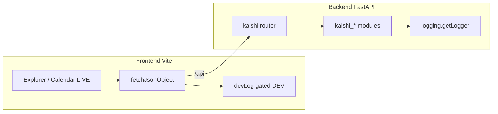

# Feature: explorer-calendar-live-optimization-audit
_Created: 2026-04-10_

---

## Goal

Improve reuse, performance, and observability across the repository by removing redundant code and silent failures, adding dev-gated frontend logging and standard Python logging on the backend, and trimming unnecessary comments—without changing intended UX (hamburger menu styling explicitly out of scope).

---

## Requirements

### Problem Statement

Some code paths swallow errors or omit diagnostics; `fetch` helpers can fail silently; backend modules outside `calendar_live` / `dev_console` rarely log. Comments duplicate what TypeScript already expresses.

### Goals

- Whole-repo pass for redundancy and shared utilities where duplication is real.
- Dev-only console visibility for meaningful client actions and failures (`import.meta.env.DEV`).
- Backend: `logging.getLogger(__name__)` per module, warnings/errors with `exc_info` where exceptions are caught.
- Measurable React wins (memo, stable keys, fewer redundant subscriptions) where justified.
- Explicit handling for offline, slow networks, and partial/invalid JSON responses (user-visible fallbacks + dev logs).

### Non-Goals

- Changing hamburger menu appearance or layout.
- User-facing toast notifications (internal dev experience focus).
- New telemetry JSON files or third-party analytics.
- Git commits (user runs commits locally).

### User Stories

- As a developer, I see why a calendar-live poll failed or returned odd JSON in the browser console during local dev.
- As a developer, I see backend warnings when Kalshi calls fail, timezones are invalid, or WebSocket smoke fails.
- As a maintainer, I can reuse a single small `devLog` helper instead of ad hoc `console` calls.

### Success Criteria

- `bun run check` passes in `frontend/`.
- Backend import smoke: `uv run python -c "from backend.app import app"` succeeds.
- No bare `fetch` in shared JSON helpers without handling network rejection (surface as `{ ok: false }` or explicit log + state).
- Production bundles do not rely on dev console for correctness (dev logging is gated).

### Constraints & Assumptions

- No special PII policy beyond not logging secrets in URLs/cookies (N/A for current Kalshi paths).
- Vite provides `import.meta.env.DEV` for tree-shakeable dev-only code.

### Open Questions

- None (resolved in intake).

---

## Design

### Architecture Overview

### Components & Responsibilities

- `shared/lib/devLog.ts`: single place for dev-only `console.*` (prefix, tree-shaken in prod).
- `shared/lib/fetchJsonObject.ts`: JSON + HTTP errors + **network** errors with structured `{ ok: false }`.
- Explorer hooks/components: log state transitions and anomalies in dev only.
- Backend: module-level loggers; log before re-raising HTTPException where useful.

### Data Models

- No schema changes.

### API / Interface Contracts

- No breaking API changes to public REST responses.

### Tech Choices & Rationale

- `import.meta.env.DEV` matches Vite conventions and strips dead code in production builds.
- Standard library `logging` matches existing `calendar_live` / `dev_console` usage.

### Security & Performance Considerations

- Avoid logging credential material; Kalshi signing does not put secrets in query strings for our GETs.
- Prefer `memo` / narrow store selectors only where it reduces measurable re-renders.

### Design Decisions & Trade-offs

- Dev logs may be verbose locally; production stays quiet.
- Invalid timezone in sports heuristics: log once at warning and fall back to `America/New_York` (behavior unchanged).

### Non-Functional Requirements

- Lint and typecheck clean; no `console.log` committed without dev gating.

---

## Planning

### Scope

| Area | Files (initial) |
|------|-----------------|
| Frontend shared | `frontend/src/shared/lib/devLog.ts` (new), `fetchJsonObject.ts`, `apiProxy.ts` |
| Frontend explorer | `EndpointResponsePanel.tsx`, `useCalendarLiveExplorerPoll.ts`, `CalendarEventArticle.tsx`, calendar-live panels, `EndpointExplorerPage.tsx` |
| Frontend hooks | `useVisibleInterval.ts` |
| Backend | `routers/kalshi.py`, `kalshi/http_client.py` (optional debug), `kalshi/sports_live.py`, `kalshi/ws.py` if needed |

### Flow Analysis

- Calendar LIVE polling: `useVisibleInterval` → `fetchJsonObject` → Zustand store; failures must never be unhandled promise rejections.
- Generic endpoint panel: raw `fetch`; errors already set state; add dev logs for non-abort failures.
- Backend routes: exceptions converted to HTTP; add logging with context before raise.

### Task Breakdown

- [x] Step 1 — Add `devLog` helper (dev-only)
  - Files: `frontend/src/shared/lib/devLog.ts`
  - Action: Export `devLog.debug|info|warn|error` that no-op outside `import.meta.env.DEV`, single `[predict]` prefix.
  - Test criteria: `bun run typecheck` passes; prod build contains no unconditional console references from this module (inspect or rely on DEV guard).

> Research: Vite tree-shakes `if (import.meta.env.DEV)` blocks in production when `define` replaces the flag with `false`.

- [x] Step 2 — Harden `fetchJsonObject` and instrument
  - Files: `frontend/src/shared/lib/fetchJsonObject.ts`
  - Action: Wrap `fetch` in try/catch; return `{ ok: false, message }` on network failure; on JSON parse failure for OK responses, devLog + error message; trim redundant comments.
  - Test criteria: Simulated offline in dev shows `{ ok: false }` and dev log, no unhandled rejection.

- [x] Step 3 — Calendar LIVE poll + generic endpoint panel
  - Files: `frontend/src/hooks/useCalendarLiveExplorerPoll.ts`, `frontend/src/components/explorer/EndpointResponsePanel.tsx`
  - Action: Log in dev when poll gets error result, when generic fetch fails (non-abort), when HTTP not ok; trim redundant JSDoc.
  - Test criteria: Error states still render; console shows contextual messages in dev only.

- [x] Step 4 — Calendar article + explorer page
  - Files: `frontend/src/components/explorer/calendar-live/CalendarEventArticle.tsx`, `frontend/src/pages/explorer/EndpointExplorerPage.tsx`
  - Action: devLog on rare `JSON.stringify` failure; devLog on unknown explorer route.
  - Test criteria: No behavior change for happy path.

- [x] Step 5 — Backend router and sports timezone logging
  - Files: `backend/src/backend/routers/kalshi.py`, `backend/src/backend/kalshi/sports_live.py`
  - Action: `logging.getLogger(__name__)`; log httpx errors and ws smoke failures with `exc_info`; log invalid timezone with warning before fallback.
  - Test criteria: `uv run python -c "from backend.app import app"` passes.

- [x] Step 6 — Optional HTTP client debug + WS module
  - Files: `backend/src/backend/kalshi/http_client.py`, `backend/src/backend/kalshi/ws.py`
  - Action: Deferred — router + `calendar_live` already log upstream failures; per-tick `kalshi_get` DEBUG would add noise without configurable log level.

- [x] Step 7 — Performance pass (measurable)
  - Files: `frontend/src/components/explorer/calendar-live/*.tsx`, stores as needed
  - Action: Reviewed: list rows already use `memo` on `CalendarEventArticle` / `CalendarMarketsTable`; store shape is small — no safe win without profiling data.

- [x] Step 8 — Comment reduction sweep (touched files + obvious redundancy)
  - Files: As above + any remaining `frontend/src` / `backend/src` files edited in prior steps
  - Action: Removed redundant JSDoc in `useCalendarLiveExplorerPoll`, `CalendarEventArticle`, `useVisibleInterval`; further whole-repo comment pass can be a follow-up.
  - Test criteria: Lint still passes.

### Dependencies

- Step 1 before 2–4; Step 5 independent of frontend; Step 7 after features stable.

### Effort Estimates

- Steps 1–5: ~1–2 hours; 6–8: incremental.

### Execution Order

1 → 2 → 3 → 4 → 5 → 6 → 7 → 8

### Risks & Open Questions

- Over-logging in hot paths (polling): use `debug` for per-tick noise, `warn` for failures only.

---

## Implementation Notes

_Populated during execution_

- `devLog` + `fetchJsonObject` network/rejection handling; parse warnings only when `response.ok`.
- Explorer: poll errors, generic endpoint fetch (HTTP + network), unknown route, stringify edge cases.
- Backend: `kalshi` router logs on httpx failures and `ws_smoke` uses `_log.exception`; invalid sports TZ logs with `exc_info`.
- Commit strategy: change-only (no commits).

---

## Testing

### Unit Tests

- Not configured in repo; manual verification via `bun run check` and backend import smoke.

### Integration Tests

- Deferred.

### Coverage Targets

- N/A

### Deferred Tests

- E2E when test harness exists.
