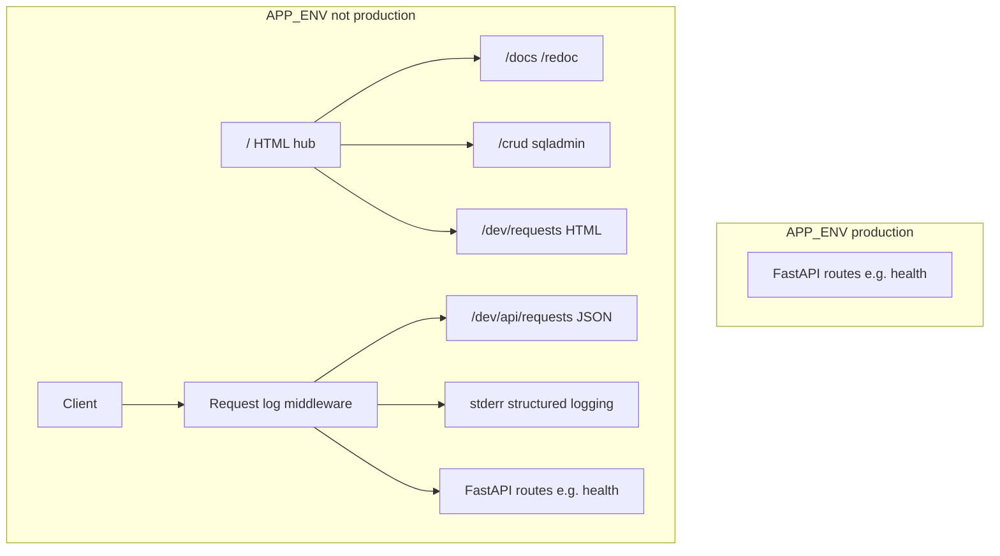

# Feature: fastapi-dev-console-and-run-hardening
_Created: 2026-04-08_

---

## Goal

In **development only**, serve a backend-hosted hub at `/` with tabbed navigation to OpenAPI UIs, **sqladmin** at `/crud` (wired for future models; no schema yet), and a live **in-browser** view of recent HTTP requests—plus structured request logging to stderr—while **production** exposes none of these. Verify and lightly tighten `run.sh` / env docs for pinned ports and dev vs prod behavior.

---

## Requirements

### Problem Statement

Local developers need a single entry point on the backend to discover routes, open Swagger/ReDoc, prepare for CRUD via an admin UI, and inspect recent API traffic—without shipping any of that surface in production.

### Goals

- **`/` (dev only):** HTML hub with tabs/sections linking to all dev-facing backend URLs (OpenAPI JSON, Swagger UI, ReDoc, `/crud`, live request log UI, `/health`, etc.).
- **`/crud` (dev only):** **sqladmin** mounted and functional; **no SQLAlchemy models or migrations** until a schema is specified—admin is “empty but ready.”
- **Observability (dev only):**
  - **A:** Swagger UI + ReDoc (FastAPI built-ins), clearly linked from the hub.
  - **B:** Structured **request/response logging** to stderr (method, path, status, duration; avoid logging secrets/bodies by default).
  - **C:** In-browser **live tail** of recent requests (in-memory ring buffer; poll-friendly JSON API + simple HTML page).
- **Production:** Dev hub, sqladmin, live log endpoints, and **OpenAPI browser UIs disabled** (no `/docs`, `/redoc`); core API routes like `/health` unchanged.
- **Auth:** Dev surfaces **unauthenticated** (localhost dev assumption).
- **Run script:** **Verification/tweaks only**—document and align with `APP_ENV` / ports; no behavioral overhaul.
- **Documentation:** List every dev/prod URL and env vars in `backend/.env.example` and `backend/README.md`.

### Non-Goals

- Designing or implementing application **database schema** or CRUD models.
- Authenticated admin, rate limiting, or remote-safe admin in dev.
- OpenTelemetry, APM, or external log aggregation.
- Changing frontend behavior beyond what is needed to document backend URLs (if at all).

### User Stories

- As a developer, I open the backend base URL in dev and immediately see tabs to docs, CRUD admin, and request activity.
- As a developer, I can watch requests hit the server in the browser without extra tools.
- As an operator, I deploy with `APP_ENV=production` and none of the dev-only UI or admin routes are exposed.

### Success Criteria

- With `APP_ENV=development`, visiting `/` shows the hub; `/docs`, `/redoc`, `/crud`, and the live request UI are reachable; hitting any route appends to the live log; stderr shows structured request lines.
- With `APP_ENV=production`, `/docs`, `/redoc`, `/crud`, hub, and live log routes are **not** registered (or return 404 consistently); `/health` still works.
- `run.sh` behavior matches documented dev/prod port semantics; `.env.example` and `backend/README.md` describe ports and URLs.

### Constraints & Assumptions

- **Stack:** **sqladmin** + **SQLAlchemy 2** for admin mounting; SQLite **in-memory** engine acceptable to satisfy sqladmin with **zero** registered models (no persistence).
- **Single Ralph feature** (one doc, one loop script later).
- **No** extra compliance constraints (no ban on SQLite or new deps).

### Open Questions

- <!-- none at planning time -->

---

## Design

### Architecture Overview

### Components & Responsibilities

| Piece | Responsibility |
|--------|----------------|
| `Settings.app_env` (`APP_ENV`) | Dev-only surfaces when lowercase value is not `production` (aligned with `run.sh`). |
| `create_app()` | Register conditional docs URLs; mount dev routes only when `APP_ENV` is not production. |
| Dev hub (`GET /`) | Static HTML + tabs linking to documented endpoints. |
| sqladmin `Admin` | Mounted at `/crud`; **no** `ModelView` until models exist. |
| Middleware | On each request: record summary to ring buffer; log structured line after response. |
| `GET /dev/api/requests` | Return last N request records as JSON (dev only). |
| `GET /dev/requests` | Simple HTML page that polls JSON and renders a table (dev only). |

### Data Models

- None for product domain. In-memory **list/deque** of request summary dicts (max N, e.g. 200), dev-only.

### API / Interface Contracts

- **Production:** Existing public JSON routes unchanged; no new public HTML except absence of dev routes.
- **Dev-only additions:** `GET /`, `GET /crud/...` (sqladmin), `GET /dev/api/requests`, `GET /dev/requests`.

### Tech Choices & Rationale

- **sqladmin:** Native FastAPI integration, CRUD-ready when SQLAlchemy models are added; matches “FastAPI admin” expectation.
- **SQLAlchemy + in-memory SQLite:** Satisfies Admin/engine requirement without creating files or schema.
- **Hub as HTMLResponse:** No frontend build; fast iteration.

### Security & Performance Considerations

- Dev-only registration prevents accidental admin exposure in prod.
- Log buffer and verbose logging **disabled** in production.
- Do not log full headers or bodies by default (risk of secrets); log method, path, status, duration.

### Design Decisions & Trade-offs

- **Unauthenticated admin:** Acceptable only for local dev; documented as such.
- **In-memory request log:** Resets on restart; sufficient for dev “what just called the API?”

### Non-Functional Requirements

- Keep `app.py` thin; dev UI wiring in a dedicated module (e.g. `backend/dev_console.py`).
- Dependencies pinned in `pyproject.toml` / `uv.lock` via `uv add`.

---

## Planning

### Scope

| Area | Files / locations |
|------|-------------------|
| Backend app | `backend/src/backend/app.py`, new `backend/src/backend/dev_console.py` (or similar) |
| Settings | `backend/src/backend/settings.py` |
| Deps | `backend/pyproject.toml`, `backend/uv.lock` |
| Docs | `backend/.env.example`, `backend/README.md` |
| Run script | `run.sh` (verify only; comments / alignment) |
| Gitignore | `.gitignore` only if a real sqlite path is introduced later (prefer in-memory for this feature) |

### Flow Analysis

1. Developer sets `APP_ENV=development`, runs `run.sh` or `uv run serve`.
2. Opens `http://127.0.0.1:{BACKEND_PORT}/` → hub.
3. Clicks Swagger/ReDoc, `/crud`, or request log; traffic appears in log UI and stderr.

### Task Breakdown

- [x] Step 1 — Document `APP_ENV` gating
  - Files: `backend/src/backend/settings.py`
  - Action: Document in code that dev-only features are registered when `APP_ENV` (``Settings.app_env``), lowercased, is not `production`; no separate boolean flag.
  - Test criteria: Reader sees how `APP_ENV` ties to `run.sh` and dev routes.

- [x] Step 2 — Dependencies (SQLAlchemy + sqladmin)
  - Files: `backend/pyproject.toml`, `backend/uv.lock`
  - Action: Add `sqlalchemy` and `sqladmin` (compatible with current FastAPI). Run `uv lock` / sync so lockfile updates.
  - Test criteria: `uv run python -c "import sqlalchemy, sqladmin"` succeeds.

- [x] Step 3 — Dev console module: engine + sqladmin + hub
  - Files: `backend/src/backend/dev_console.py` (new), `backend/src/backend/app.py`
  - Action: In-memory SQLite engine; `Admin(..., base_url="/crud")` with **no** model views; HTML hub at `GET /` with tab-style nav and sections; mount only when `APP_ENV` lowercased is not `production`.
  - Test criteria: `APP_ENV=development`: `TestClient` GET `/` 200 HTML; GET `/crud/` 200. `APP_ENV=production`: GET `/` and `/crud/` 404; `/health` 200.

- [x] Step 4 — Structured logging + live JSON + HTML tail
  - Files: `backend/src/backend/dev_console.py`
  - Action: Middleware records method, path, query, status, duration ms to buffer (max 200); skips logging `GET /dev/api/requests` to avoid poll noise. One line per request to stderr via logger `backend.http`. `GET /dev/api/requests` (JSON, newest first) and `GET /dev/requests` (HTML + safe DOM updates). Only mounted when `APP_ENV` is not `production`.
  - Test criteria: `TestClient` GET `/health` then `/dev/api/requests` shows health row; production mount skipped so `/dev/api/requests` not registered (404).

- [ ] Step 5 — Production: disable OpenAPI UIs
  - Files: `backend/src/backend/app.py`
  - Action: When not `dev_ui_enabled`, pass `docs_url=None`, `redoc_url=None`, `openapi_url=None` to `FastAPI()` **or** equivalent so `/docs` and `/redoc` are absent in production.
  - Test criteria: Under production settings, `/docs` and `/openapi.json` are not served (404).

- [ ] Step 6 — Documentation and run script verification
  - Files: `backend/.env.example`, `backend/README.md`, `run.sh` (if tiny comment tweaks only)
  - Action: Document `APP_ENV`, ports, and every dev URL (`/`, `/docs`, `/redoc`, `/openapi.json`, `/crud`, `/dev/requests`, `/dev/api/requests`, `/health`). Confirm `run.sh` already frees ports on start and on exit for non-production; align wording with backend behavior.
  - Test criteria: A new reader can find all URLs from README + `.env.example` without reading source.

### Dependencies

- Task order: 1 → 2 → 3 → 4 → 5 → 6 (5 may be combined with 3–4 in one commit if desired; keep checklist atomic for Ralph).

### Effort Estimates

- Step 1: S
- Step 2: S
- Step 3: M
- Step 4: M
- Step 5: S
- Step 6: S

### Execution Order

As listed in Task Breakdown.

### Risks & Open Questions

- **sqladmin empty model list:** If a version requires at least one model, add a single **non-persistent** placeholder model or document fallback—verify during Step 3.
- **Middleware + streaming responses:** Ensure middleware always records final status code when possible.

> **Research (Step 2–3):** sqladmin targets FastAPI/Starlette and SQLAlchemy 2.x; `Admin(app, engine, base_url="...")` mounts the UI under that prefix. Empty model registration yields an admin shell with no tables until `ModelView` subclasses are added.
> **Research (Step 4):** Starlette `BaseHTTPMiddleware` is acceptable for dev-only tracing; avoid logging sensitive headers (`Authorization`, cookies). Prefer logging after `call_next` returns to capture response status.

---

## Implementation Notes

_Populated during execution_

---

## Testing

### Unit Tests

- Optional: add `httpx` `TestClient` tests in a later iteration; not required for initial Ralph loop unless repo already has pytest (currently **no** backend test harness).

### Integration Tests

- Manual: run `uv run serve` with `APP_ENV=development` and click through hub; switch to `production` and confirm UIs gone.

### Coverage Targets

- N/A until pytest is introduced.

### Deferred Tests

- Automated `TestClient` matrix for dev vs prod once test tooling exists.
