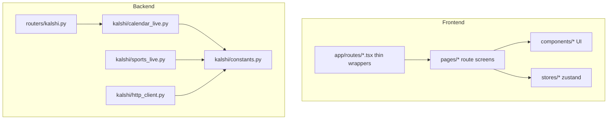

# Feature: full-stack-reoptimization

_Created: 2026-04-10_

---

## Goal

Restructure the frontend with a dedicated `pages` layer and consistent `@` imports, and consolidate backend Kalshi constants while removing in-repo dead code—**without changing runtime behavior** (same routes, API contracts, and responses).

---

## Requirements

### Problem Statement

After rapid feature work (API explorer, calendar-live panels), layout logic lives beside route modules, Kalshi tuning values are scattered across large modules, and the Kalshi package exposes unused re-exports. The codebase needs a maintainable layout before further features land.

### Goals

- **Frontend:** Introduce `src/pages/` with a new `@pages/*` alias; route modules under `src/app/routes/` become thin wrappers that default-export page components. Preserve React Router 7 route module conventions, memoization, and zustand stores.
- **Frontend:** Keep **no barrel `index.ts` files**; use direct `@…` imports only.
- **Frontend:** Tooling in scope: `tsconfig.app.json`, `vite.config.ts`, `eslint.config.js`, Prettier (already part of `lint`).
- **Backend:** Add a **single** `backend/kalshi/constants.py` for shared Kalshi literals (limits, URLs, frozensets, metadata dicts) currently at module top-level in `calendar_live.py`, `sports_live.py`, `http_client.py`.
- **Backend:** Remove symbols/files with **no references anywhere in the repo** (strict “dead code” definition).
- **Backend:** Leave `/dev/*` and `dev_console.py` behavior and routes **unchanged** (no removal of backend dev endpoints).
- **Verification:** `bun run check` (frontend) + `uv run python -c "…"` import smoke (backend). No new test framework required for this pass.

### Non-Goals

- No intentional API or response-shape changes.
- No `git commit`, `git push`, or PR workflow in this iteration (local work only).
- No renaming `src/types` → `.types` (project uses `@typings/*` per `tsconfig.app.json`).
- No telemetry, memory JSON files, or Ralph loop artifacts.

### User Stories

- As a maintainer, I can find route-level UI in `pages/` and reusable UI in `components/` without duplication.
- As a maintainer, I can tune Kalshi limits and public v1 URL in one module.
- As a reviewer, I can trust that removals were reference-checked in-repo only.

### Success Criteria

- `bun run check` passes after frontend moves.
- Backend import smoke passes (app factory imports).
- No new barrel files; imports resolve via existing + new `@pages` alias.
- Kalshi HTTP/WS/signing behavior unchanged (same literals moved, not recomputed).

### Constraints & Assumptions

- React 19 + React Router 7 framework mode; Vite proxy `/api` unchanged.
- Python 3.12+, `uv` for backend.
- **No “risky” deletes:** signing, `http_client`, `ws`, and router handlers remain intact; only clearly unreferenced package glue may be removed.

### Open Questions

- None for execution; optional follow-up: add `vulture` or `ruff` unreachable-code rules as a separate hardening task.

---

## Design

### Architecture Overview

### Components & Responsibilities

| Area | Responsibility |
|------|------------------|
| `src/app/routes/` | Route module entry: `default` export only; wires RR7 to `pages/`. |
| `src/pages/` | Composes layout and endpoint views; owns no global CSS beyond imports. |
| `src/components/` | Presentational and feature widgets (explorer panels, UI primitives). |
| `backend/kalshi/constants.py` | Frozen literals and small metadata dicts (no I/O). |

### Data Models

- No schema migrations. TypeScript types stay under `src/types` (`@typings`).

### API / Interface Contracts

- FastAPI routes and response shapes unchanged.

### Tech Choices & Rationale

- **`@pages/*`:** Matches Medium-style scalable structure without breaking existing `@components`, `@stores`, etc.
- **Single Kalshi constants module:** User preference; keeps `dev_console` constants local unless a clear duplicate appears.

### Security & Performance Considerations

- No new secrets; constant moves are copy-paste equivalent.
- No bundle regressions expected; route modules stay default-export-only for RR codegen.

### Design Decisions & Trade-offs

- **Slim `kalshi/__init__.py`:** Package re-exports are unused in-repo; removing them reduces maintenance and matches “no barrels” spirit—**only** if `rg` confirms zero `from backend.kalshi import …` usage.

### Non-Functional Requirements

- ESLint + Prettier remain the frontend quality gate; no new dependencies required for this feature doc’s tasks.

---

## Planning

### Scope

**Frontend (~33 TS/TSX files under `frontend/src`):** `app/`, `components/`, `constants/`, `hooks/`, `shared/`, `stores/`, `styles/`, `types/`. Tooling: `vite.config.ts`, `tsconfig*.json`, `eslint.config.js`.

**Backend (~13 Python files under `backend/src/backend`):** `app.py`, `routers/`, `kalshi/*`, `settings.py`, `dev.py`, `dev_console.py` (touch only if needed for consistency—prefer **no** edits to dev console).

### Flow Analysis

- User hits `/` → redirect to default explorer path → layout + outlet → endpoint panel by route id.
- Backend: Kalshi routes → `calendar_live` / `http_client` / `ws` — constants are read at import or call time; extraction must preserve values exactly.

### Task Breakdown

- [x] Step 1 — Backend: add `kalshi/constants.py` and extract literals
  - Files: `backend/src/backend/kalshi/constants.py`, `backend/src/backend/kalshi/calendar_live.py`, `backend/src/backend/kalshi/sports_live.py`, `backend/src/backend/kalshi/http_client.py`
  - Action: Move module-level numeric limits, frozensets, metadata dicts, and `http_client` v1 base URL into `constants.py`; update imports. **No logic changes.**
  - Test criteria: `uv run python -c "from backend.app import app; print('ok')"` from `backend/` (or project-root equivalent with `PYTHONPATH` as currently documented).
  - > Research: Single source of truth for “magic numbers” reduces drift between `calendar_live` and `sports_live`; keep names grep-friendly (`EVENTS_PAGE_LIMIT`, etc.).

- [x] Step 2 — Backend: remove unused package re-exports
  - Files: `backend/src/backend/kalshi/__init__.py`
  - Action: If `rg` confirms no `from backend.kalshi import` usage, replace re-exports with a short package docstring only.
  - Test criteria: Same import smoke as Step 1; `rg "from backend\.kalshi import"` empty in repo.
  - > Research: Empty `__init__.py` is idiomatic for namespace packages without a public facade; avoids unused `__all__` maintenance.

- [x] Step 3 — Backend: second-pass dead code (repo-wide references)
  - Files: TBD by `rg`/manual audit (only files proven unreferenced)
  - Action: Delete or inline-remove functions/constants with **zero** references in the repository (per your rule **A**). **Do not** touch signing, WS smoke, or router handlers except to adjust imports after Step 1.
  - Test criteria: Import smoke + manual sanity that Kalshi routes still register on `app.routes`.
  - > Research: Without `vulture`, rely on exhaustive `rg` for symbol names; conservative: skip anything ambiguous.

- [x] Step 4 — Frontend: add `@pages` alias and `src/pages/` tree
  - Files: `frontend/tsconfig.app.json`, `frontend/vite.config.ts`, new files under `frontend/src/pages/`
  - Action: Add path alias `@pages/*` → `./src/pages/*` (mirror existing style). Create `pages/explorer/` (or flatter) with default-export components moved out of `app/routes/`.
  - Test criteria: `bun run check` passes.
  - > Research: RR7 route modules often stay tiny; moving UI to `pages/` matches “scalable React structure” articles without breaking `react-router.config` conventions.

- [x] Step 5 — Frontend: thin route modules
  - Files: `frontend/src/app/routes/explorerLayout.tsx`, `frontend/src/app/routes/endpoint.tsx`, `frontend/src/app/routes/indexRedirect.tsx`
  - Action: Each file becomes a one-line or minimal re-export: `export { default } from '@pages/...'` (or equivalent) so RR still receives the same default export.
  - Test criteria: `bun run check`; dev navigation across all explorer tabs still works.
  - > Research: Preserving `default` export on route modules is required for RR route manifest generation.

- [x] Step 6 — Frontend: import hygiene and types
  - Files: any touched TS/TSX under `pages/`, `components/`, `app/`
  - Action: Ensure imports use `@pages`, `@components`, `@typings`, etc.—no new barrels. Consolidate only if a duplicate type is **obviously** the same (behavior-preserving).
  - Test criteria: `bun run check`.
  - > Research: `verbatimModuleSyntax` + `noUnusedLocals` punish unused type imports—clean as you go.

- [x] Step 7 — Tooling pass (Prettier + ESLint alignment)
  - Files: `frontend/eslint.config.js`, `frontend/package.json` (only if script gaps), formatted sources touched above
  - Action: Confirm `lint` still runs `eslint` + `prettier --check`; run `bun run format` on touched frontend files if needed.
  - Test criteria: `bun run lint` clean.
  - > Research: `eslint-config-prettier` already last in flat config—avoid duplicate formatting rules.

### Dependencies

- Steps 1 → 3 (backend) can proceed before or in parallel with 4 → 7 (frontend) by different agents; within backend, Step 1 before Step 2–3.

### Effort Estimates

- Backend constants + smoke: ~1–2 hours.
- Frontend pages split + alias: ~1–2 hours.
- Dead-code pass: ~0.5–1 hour (small codebase).

### Execution Order

1. Step 1 → Step 2 → Step 3 (backend)
2. Step 4 → Step 5 → Step 6 → Step 7 (frontend)

### Risks & Open Questions

- **Risk:** Copy-paste error when moving constants → **Mitigation:** byte-for-byte compare or small script to assert equality before/after.
- **Risk:** RR7 route discovery if default export chain breaks → **Mitigation:** keep `export { default } from '…'` pattern and run `react-router typegen` via `bun run check`.

---

## Implementation Notes

- **2026-04-10:** Added `backend/kalshi/constants.py` with Kalshi v1 URL, calendar-live limits, sports classification sets, and `METADATA_SPORTS_RE`. Wired `calendar_live.py`, `sports_live.py`, `http_client.py`; dropped unused `re` import from `sports_live.py`.
- **2026-04-10:** Replaced `kalshi/__init__.py` re-exports with a docstring (no in-repo `from backend.kalshi import` consumers).
- **2026-04-10:** Added `@pages/*` → `src/pages/`; moved explorer layout, endpoint, and index redirect UI to `pages/explorer/`; route modules re-export defaults only.
- **Verification:** `uv run python -c "from backend.app import app"` (from `backend/`) → `ok`. `bun run check` (frontend) → pass.

- Commit / PR strategy: **local only** — no commits unless you later request them.

---

## Testing

### Unit Tests

- Deferred; repo has no pytest suite wired for backend.

### Integration Tests

- Manual: open explorer, switch tabs, confirm JSON and calendar panels still load.

### Coverage Targets

- N/A for this refactor.

### Deferred Tests

- Optional: add `vulture` CI step for backend unused symbols.

---

## Ralph loop script (optional)

Verification suite for `ralph_full-stack-reoptimization.sh` (if you run the loop later):

- **Build:** `cd frontend && bun run build`
- **Lint/types:** `cd frontend && bun run check` (includes typegen + tsc + eslint + prettier + build)
- **Backend:** `cd backend && uv run python -c "from backend.app import app; print('ok')"`

Agents must not commit unless you change the stored commit strategy.
