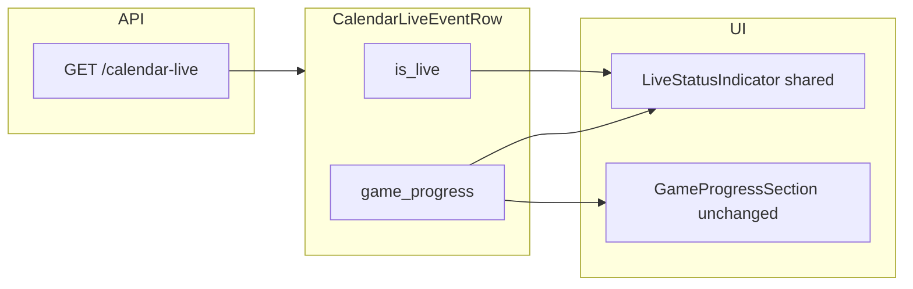

# Feature: home-live-clock-beside-label
_Created: 2026-04-20_

---

## Goal

Show a compact game clock beside the LIVE pill on home column events and sports calendar explorer articles, using existing `/calendar-live` payload (`game_progress.timers`), with sport-aware period labels (e.g. `Q3 4:32`), graceful fallbacks when timer data is partial, and `—` when live without progress.

---

## Requirements

### Problem Statement

Home LIVE row shows only “LIVE”; explorer article has no analogous LIVE row. Clock details exist deeper in `game_progress` / `timers` but are not surfaced inline next to LIVE.

### Goals

- Inline clock beside LIVE in **HomeEventBlock** (`HomeGamesColumn.tsx`).
- **Mirror** same structure in **CalendarEventArticle** when sports calendar row is live (`is_live`).
- Prefer combined label **`Q3 4:32`** style (period prefix + clock).
- **`segment_seconds_remaining`** handling:
  - Treat as redundant with clock when both measure the same segment countdown **and** values agree (compare parsed `clock_display` MM:SS seconds to `segment_seconds_remaining`; small tolerance e.g. ±1s for refresh skew).
  - When equal: drive displayed time from **`segment_seconds_remaining`** (formatted `m:ss`).
  - When `clock_display` is **null** and `segment_seconds_remaining` is set: show muted inline copy **`Segment Seconds Remaining`** plus formatted value (not duplicated as generic “time left” in the inline chip if that would repeat list content — list in `GameProgressSection` stays as-is per product).
- Keep **`GameProgressSection`** list unchanged (**duplicate OK**): no removal of existing “Clock …” / segment lines there.
- **`is_live` + no `game_progress`**: show clock area as **`—`** (em dash).
- **A11y**: separate muted `` for clock; compose **`aria-label`** on the LIVE row container so SR gets one concise phrase (e.g. “Live, game clock Q3 4 minutes 32 seconds” — exact wording in implementation).
- **Styling**: clock matches **muted grey** like secondary text; LIVE styling unchanged.

### Non-Goals

- Backend / Kalshi schema changes for this iteration.
- Removing or changing milestone acceptance rules (explicitly out of scope).

### User Stories

- As a home viewer, I see period + clock next to LIVE without scrolling to game progress.
- As an explorer user, I see the same LIVE + clock pattern for consistency.

### Success Criteria

- Live events with timer data show **`Qn …`** (or sport-appropriate period label) + time when derivable from payload rules above.
- Live events without `game_progress` show **`—`** next to LIVE.
- `bun run check` passes for touched frontend files.

### Constraints & Assumptions

- Data source: `CalendarLiveEventRow.game_progress.timers` only (`clock_display`, `period_index`, `segment_seconds_remaining`, plus `sport` on `GameProgressV1`).
- Soccer / MLB / NHL period strings may differ from `Q`; implementation maps by `sport` code already on `GameProgressV1`.

### Open Questions

- None blocking: period label conventions for OT / extra innings can follow existing backend `infer_sport_code` families and minimal heuristics (documented in code comments if non-obvious).

---

## Design

### Architecture Overview

### Components & Responsibilities

- **Pure formatter** (`@utils/formatLiveClockInline.ts` or similar): input `GameProgressV1 | null`, `isLive: boolean` → structured result: `{ primary: string | null, segmentFallback: string | null, ariaLabel: string }` or single display string + aria helper.
- **`LiveStatusIndicator`** (new, `frontend/src/components/`): props `classPrefix: 'home-games' | 'calendar-live-explorer'`, `isLive`, `gameProgress`, renders dot + LIVE + muted clock spans.
- **Home**: replace inline `
…` block with shared component or shared children.
- **Explorer**: insert same block under article title when `isSportsCalendar && row.is_live` (order aligned with home: title → LIVE row → `live_title` → `GameProgressSection`).

### Data Models

Uses existing `GameProgressV1` / `GameProgressTimersV1` (`frontend/src/types/calendarLiveTypes.ts`). No schema changes.

### API / Interface Contracts

No HTTP changes.

### Tech Choices & Rationale

- Pure functions for clock equality + formatting → unit-testable without React; keeps `HomeEventBlock` / `CalendarEventArticle` thin.
- Shared component avoids CSS / markup drift between home and explorer.

### Security & Performance Considerations

None beyond existing client-side rendering.

### Design Decisions & Trade-offs

| Decision | Trade-off |
|----------|-----------|
| ±1s tolerance comparing MM:SS vs segment seconds | Avoids flicker when sources tick differently |
| Sport-specific period prefix | Slightly more code vs always `Q{n}` |

### Non-Functional Requirements

- No extra polling; display updates when calendar-live payload refreshes like today.

---

## Planning

### Scope

| Area | Files (initial) |
|------|-------------------|
| Formatter | `frontend/src/utils/formatLiveClockInline.ts` (new), possibly extend `formatGameProgress.ts` exports if sharing `formatSeconds` |
| Component | `frontend/src/components/live/LiveStatusIndicator.tsx` (new, path TBD to match repo conventions) |
| Home | `frontend/src/pages/home/HomeGamesColumn.tsx`, `frontend/src/pages/home/homePage.css` |
| Explorer | `frontend/src/components/explorer/calendar-live/CalendarEventArticle.tsx`, `frontend/src/components/explorer/calendar-live/calendarLiveExplorer.css` |

### Flow Analysis

1. Store serves `CalendarLiveExplorerStore.entries[calendar-live].payload.events`.
2. `HomeGamesColumn` / explorer panel map rows to articles.
3. When `is_live`, render LIVE row; formatter reads `row.game_progress` for inline clock.
4. `GameProgressSection` still renders below when `game_progress` present.

### Task Breakdown

- [x] **Step 1 — Inline clock formatter + segment/clock agreement**
  - Files: `frontend/src/utils/formatLiveClockInline.ts` (new); optionally adjust `frontend/src/utils/formatGameProgress.ts` to export `formatSeconds` if needed for reuse
  - Action: Implement parsing of `clock_display` as MM:SS where possible; compare to `segment_seconds_remaining` with ±1 tolerance; build period prefix from `game_progress.sport` + `timers.period_index` (e.g. NBA/NFL/WNBA → `Q{n}`, NHL → `P{n}`, soccer halves → `1H`/`2H` or minute-based per existing patterns); output primary string `Q3 4:32` when both parts exist; when `clock_display` null and `segment_seconds_remaining` present, return segment fallback label + formatted time; when `is_live` and `game_progress` null, return em dash for display; build `ariaLabel` string for the combined live row.
  - Test criteria: Manual table of inputs (null gp, gp with only segment, matching clock+segment, mismatching, period edge cases); run `bun run typecheck` on frontend.

- [x] **Step 2 — LiveStatusIndicator component**
  - Files: `frontend/src/components/live/LiveStatusIndicator.tsx` (new), colocate styles via existing BEM `classPrefix` pattern
  - Action: Render pulse dot, “LIVE”, muted clock `span` with `aria-hidden` on decorative pieces where appropriate; root element `aria-label` from formatter; support both class prefixes for CSS hooks.
  - Test criteria: No duplicate visible “LIVE” when `is_live` false (component not used); snapshot eyeball in dev for home + explorer.

- [x] **Step 3 — Home column wiring**
  - Files: `frontend/src/pages/home/HomeGamesColumn.tsx`, `frontend/src/pages/home/homePage.css`
  - Action: Replace manual LIVE markup with `LiveStatusIndicator`; ensure status line shows when `row.is_live` including clock `—` without progress; reuse `.home-games__status-extra` or add sibling class for muted clock matching spec.
  - Test criteria: Home page with mock/live data shows LIVE + clock; `bun run check`.

- [x] **Step 4 — Explorer CalendarEventArticle wiring + CSS**
  - Files: `frontend/src/components/explorer/calendar-live/CalendarEventArticle.tsx`, `frontend/src/components/explorer/calendar-live/calendarLiveExplorer.css`
  - Action: When `isSportsCalendar && row.is_live`, render `LiveStatusIndicator` with `calendar-live-explorer` prefix after title (same order as home); add CSS mirroring `.home-games__status-line` / live-indicator / muted clock (no redundant live-title green conflict — LIVE row is separate from `live_title` block).
  - Test criteria: Explorer sports view shows LIVE + clock for live rows; `bun run check`.

### Dependencies

Step 1 → Step 2 → Steps 3–4 (3 and 4 can proceed in parallel after Step 2).

### Effort Estimates

| Step | Estimate |
|------|----------|
| 1 | M |
| 2 | S |
| 3–4 | S each |

### Execution Order

1 → 2 → 3 → 4

### Risks & Open Questions

| Risk | Mitigation |
|------|------------|
| `clock_display` not always MM:SS | Use raw substring for time part when parse fails but string present |
| OT / extra innings labeling | Fallback `OT` / `Inn n` when `period_index` exceeds regulation segment count |

#### Research (Step 1)

> Backend `game_progress._timers` sets `clock_display` from string fields (`game_clock`, `clock`, …) and `segment_seconds_remaining` via `_extract_segment_remaining_seconds` reading overlapping keys (`segment_seconds_remaining`, `quarter_seconds_remaining`, …). Same Kalshi blob can populate both; frontend equality check validates “same countdown” without another API.

#### Research (Step 2)

> Mirror `GameProgressSection`’s `classPrefix` pattern for explorer vs home consistency (`frontend/src/components/explorer/calendar-live/GameProgressSection.tsx`).

#### Research (Steps 3–4)

> Home markup reference: `frontend/src/pages/home/HomeGamesColumn.tsx` lines 76–86; CSS tokens `home-games__live-indicator`, `home-games__status-extra` in `homePage.css`.

---

## Implementation Notes

- `formatSeconds` exported from `formatGameProgress.ts`; `liveClockInline` in `formatLiveClockInline.ts` builds `Q3 4:32` / segment fallback / `—`.
- `LiveStatusIndicator` (`components/live/LiveStatusIndicator.tsx`): `role="status"` + `aria-label` on row; visual LIVE row `aria-hidden`.
- Home + explorer wired; explorer styles mirror home in `calendarLiveExplorer.css`.

---

## Testing

### Unit Tests

- Optional pure-function tests if/when frontend test runner is added; until then manual matrix + typecheck.

### Integration Tests

- Deferred (no frontend test harness in repo).

### Coverage Targets

- N/A

### Deferred Tests

- Playwright smoke if LIVE fixtures exist later.

---

## Verification commands (repo)

- `cd frontend && bun run check` (user preference: primary gate)
