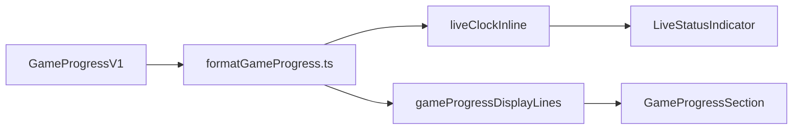

# Feature: home-live-display-simplify

_Created: 2026-04-20_

---

## Goal

Fewer overlapping modules for live clock + LIVE row on home and calendar-live explorer; one compact pure formatter composed from small single-purpose helpers, smallest diff, no test file edits, no commits from agent.

---

## Requirements

### Problem Statement

`formatLiveClockInline.ts` and `formatGameProgress.ts` both touch game progress timers; period/sport labeling duplicates mental model with backend. Two files for inline clock increases navigation cost.

### Goals

- Single module owns timer-related formatting used by `LiveStatusIndicator` + `gameProgressDisplayLines`.
- Preserve UI: clock beside `.home-games__live-label` / explorer equivalents; `GameProgressSection` unchanged on home.
- Shared surfaces: `HomeGamesColumn`, `CalendarEventArticle` (via `LiveStatusIndicator` only).

### Non-Goals

- Backend / milestone validation changes (explicitly out of scope).
- Changing `GameProgressSection` behavior or layout on home.
- New or modified test files.

### User Stories

- As a maintainer, I follow one file for “how we render clocks from `GameProgressV1`”.
- As a user, live row looks identical after refactor.

### Success Criteria

- `LiveStatusIndicator` imports compact clock API from `@utils/formatGameProgress` only.
- `formatLiveClockInline.ts` removed; no duplicate clock pipeline.
- Helpers have single responsibilities; `liveClockInline` orchestrates (same outputs as today).
- Frontend `typecheck` + `lint` pass.

### Constraints & Assumptions

- No commits unless user opts in later.
- Period label rules stay aligned with current frontend (backend duplication acknowledged; no Python changes).

### Open Questions

- None blocking implementation.

---

## Design

### Architecture Overview

### Components & Responsibilities

| Piece | Responsibility |
|-------|----------------|
| `formatSeconds` | Numeric seconds → `m:ss` (existing). |
| `parseMmssClockSeconds` | Parse Kalshi MM:SS clock string → seconds. |
| `formatLivePeriodPrefix` | Sport + `period_index` → `Q3` / `P2` / … (extracted from current inline logic). |
| `liveClockInline` | Compose timer fields → `{ clockVisual, ariaLabel }` (behavior preserved). |
| `gameProgressDisplayLines` | Verbose explorer lines (unchanged semantics). |
| `LiveStatusIndicator` | Thin React wrapper; memo + `aria-label`. |

### Data Models

Uses existing `GameProgressV1` from `@typings/calendarLiveTypes`.

### API / Interface Contracts

- Export `liveClockInline`, `LiveClockInlineResult` type (if needed externally), and any small helpers only if another module needs them (prefer keeping parse private unless already part of public API — today only `liveClockInline` is consumed by UI).

### Tech Choices & Rationale

- Collapse into `formatGameProgress.ts` to remove an entire file and one import hop; smallest diff.

### Security & Performance Considerations

- Pure functions; no network. `useMemo` in `LiveStatusIndicator` unchanged.

### Design Decisions & Trade-offs

- Not adding sport-specific labels to `gameProgressDisplayLines` “Segment N” line in this pass — avoids UX change; consolidation is file structure + helpers for inline clock only.

### Non-Functional Requirements

- Zero test file changes; verify via typecheck/lint.

---

## Planning

### Scope

| Area | Files |
|------|-------|
| Consolidate | `frontend/src/utils/formatGameProgress.ts`, `frontend/src/utils/formatLiveClockInline.ts` (delete) |
| Import update | `frontend/src/components/live/LiveStatusIndicator.tsx` |
| Unchanged behavior | `HomeGamesColumn.tsx`, `CalendarEventArticle.tsx`, `GameProgressSection.tsx`, CSS |

### Flow Analysis

1. `LiveStatusIndicator` receives `game_progress` → calls `liveClockInline`.
2. `liveClockInline` reads `gp.timers`, sport, agreement between segment seconds and parsed clock — **preserve algorithm**.
3. `gameProgressDisplayLines` continues using `formatSeconds` only for line items.

### Task Breakdown

- [x] Step 1 — Move inline clock into `formatGameProgress.ts` with extracted helpers
  - Files: `frontend/src/utils/formatGameProgress.ts`, `frontend/src/utils/formatLiveClockInline.ts`, `frontend/src/components/live/LiveStatusIndicator.tsx`
  - Action: Append `LiveClockInlineResult`, `parseMmssClockSeconds` (export only if needed), `formatLivePeriodPrefix` (or equivalent name), constants (`MMSS_CLOCK`, `AGREEMENT_SLACK_SEC`), and `liveClockInline` from current `formatLiveClockInline.ts`. Structure as small functions each doing one thing; `liveClockInline` only wires them. Delete `formatLiveClockInline.ts`. Point `LiveStatusIndicator` at `@utils/formatGameProgress`.
  - Test criteria: `cd frontend && bun run typecheck && bun run lint` clean; visually unchanged LIVE + clock on home and explorer (manual spot-check).

### Dependencies

- None external.

### Effort Estimates

- Small: one consolidation PR-sized change.

### Execution Order

- Step 1 only (single cohesive refactor).

### Risks & Open Questions

- Missed import of deleted module → caught by typecheck.

#### Research

> **Step 1:** Moving TS between files is safe if exports match; `grep` shows only `LiveStatusIndicator` imports `formatLiveClockInline`. Prefer private `parseMmssClockSeconds` if nothing else imports it post-move. Preserve default export surface: only `liveClockInline` + type needed by component.

---

## Implementation Notes

- Merged `formatLiveClockInline.ts` into `formatGameProgress.ts`: helpers `parseMmssClockSeconds`, `formatLivePeriodPrefix`, `floorSegmentSecondsRemaining`, `trimClockDisplay`, `liveClockSegmentFallbackBody`, `resolveLiveClockTimePart`, `combinePeriodPrefixAndTime`; exported `liveClockInline` + `LiveClockInlineResult`. Removed deleted file.
- `LiveStatusIndicator` imports `liveClockInline` from `@utils/formatGameProgress`.

---

## Testing

### Unit Tests

- Deferred per user request (no test file changes).

### Integration Tests

- None required for this refactor.

### Coverage Targets

- N/A.

### Deferred Tests

- Optional future tests for `liveClockInline` edge cases (clock vs segment disagreement).
