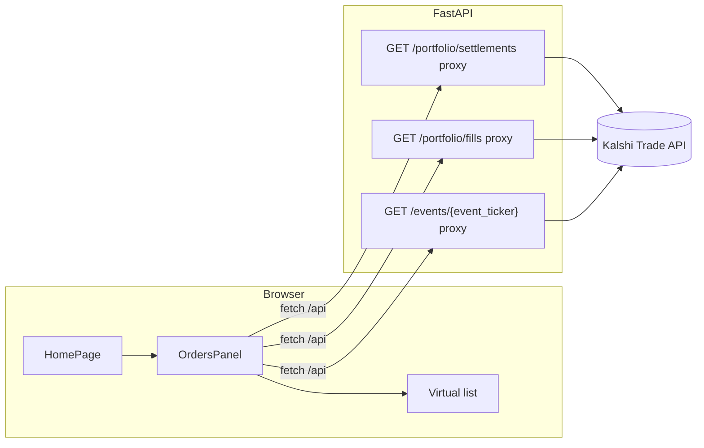

# Feature: home-right-column-orders-panel

_Created: 2026-04-17_

---

## Goal

Populate homepage right column with stacked layout: placeholder card (matches event-card styling), plus borderless scroll region listing **one row per event** with event title, **event ticker**, **order id**, **settled USD P&amp;L** (−/+), infinite-style loading (50 events per batch), manual refresh only, vertical virtual list.

---

## Requirements

### Problem Statement

Right column (`home-page__aside`) is unused; users need consolidated **settled** performance per Kalshi **event**.

### Goals

- Two stacked sections: fixed-height bordered empty card on top (reserved); borderless flexible panel below with gap matching `home-games` stacking (`1.25rem`).
- Panel shows rows: **event name**, **event ticker**, **order id**, **net settled P&amp;L** — green `+$x.xx` vs red `−$x.xx`, two decimals USD.
- **Settled only** — derived from Kalshi **`GET /portfolio/settlements`** (not open orders).
- **Filled / executed exposure**: use settlements + fills only (no live marks).
- **Pagination**: target **50 event rows per batch**; fetch more when user scrolls near **end** of virtual list until API reports no further settlement pages.
- **Manual refresh** button triggers full reload (reset cursors/lists).
- **Empty UX**: render **nothing** (no skeleton, no copy) until first successful dataset is ready to display; treat “zero rows after load” as still “nothing rendered” unless we later revise.
- **Responsive**: below breakpoint, aside **stacks below** primary column.

### Non-Goals

- User accounts / OAuth (single server-side Kalshi credential as today).
- Real-time websocket updates.
- Editing orders.

### User Stories

- As a trader, I refresh and scroll my settled history per event without loading entire history at once.
- As a trader, I see whether each event net-won or net-lost in USD.

### Success Criteria

- Layout matches left column spacing and card border token (`--border`, radius `0.5rem`).
- P&amp;L matches sums computed from settlement rows grouped by `event_ticker`, net of fees (see Design).
- Virtualized list stays smooth for long histories.
- Typecheck + lint + build pass.

### Constraints & Assumptions

- **Security**: Kalshi Trade API requires RSA-PSS signing. **Cannot** call Kalshi directly from browser with private key. **React app** calls `/api/...` proxies only (same pattern as calendar-live / balance). This overrides literal “Kalshi from frontend” wording — UI is frontend; credentials stay server-side.
- Single Kalshi API key configured on backend (`KALSHI_API_KEY_ID`, `KALSHI_PRIVATE_KEY_PEM`).

### Open Questions

- None blocking implementation; **order id** is not on `Settlement` objects — resolved via **`GET /portfolio/fills`** join keyed by market `ticker` (see Design).

---

## Design

### Architecture Overview

### Components & Responsibilities

- **`HomePage`**: grid column contains placeholder card + orders panel.
- **`HomeOrdersPanel`** (new): refresh button, scroll container, virtual list, fetch orchestration.
- **Utilities**: parse settlement/fill JSON, aggregate by `event_ticker`, format currency with sign/color.

### Data Models

**Settlement** (Kalshi): `event_ticker`, `ticker` (market), `revenue` (integer cents), `fee_cost` (fixed-point dollars string), etc.

**Fill** (Kalshi): `order_id`, `ticker`, `ts` / `created_time`.

**Aggregated row (internal)**

- `event_ticker: string`
- `event_title: string | null` (lazy from `GET /events/{event_ticker}`)
- `order_id: string | null` — latest fill `order_id` among market tickers that appear in settlement rows for this event (by max fill timestamp); `null` if fills unavailable for those tickers.
- `net_usd: number` — sum over settlements in group: `(revenue / 100) − parseUsd(fee_cost)` per row.

### API / Interface Contracts

New FastAPI routes (mirror existing `markets` passthrough style):

- `GET /portfolio/settlements` — forward `limit`, `cursor`, `min_ts`, `max_ts`, `ticker`, `event_ticker` query params.
- `GET /portfolio/fills` — forward `limit`, `cursor`, `min_ts`, `max_ts`, `ticker`, `order_id`.
- `GET /events/{event_ticker}` — path param URL-encoded.

Frontend endpoints in `apiEndpointsConstants` + proxied URLs `toProxiedUrl('/portfolio/settlements')` etc.

### Tech Choices & Rationale

- **`@tanstack/react-virtual`**: lightweight windowing; no unused full-list render.
- **Settlements primary source for P&amp;L** — aligns with “settled only”.
- **Fills** — only for `order_id` + join key `ticker`.

### Security & Performance Considerations

- No key material in frontend bundle.
- Fills pagination may be large on refresh — page through with `cursor` until exhausted **or** stop when every `ticker` seen in settlement batch has a fill mapping (optimization: optional cap documented in Implementation if needed).

### Design Decisions & Trade-offs

- **Batching “50 events”**: API pages are **settlements**, not events. Loader loops: pull settlement pages with `limit` (e.g. 100), merge into aggregation map until **50 new distinct `event_ticker` groups** appended **or** settlements `cursor` absent.
- **Order id**: not in settlement payload; **derived** from fills — trade-off is extra fill pages on refresh.

### Non-Functional Requirements

- Keyboard-accessible refresh control.
- No `console.log` noise; use existing `devLog` where needed.

---

## Planning

### Scope

| Area | Files (expected) |
|------|-------------------|
| Backend proxies | `backend/src/backend/routers/kalshi.py` |
| Frontend home layout | `frontend/src/pages/home/HomePage.tsx`, `frontend/src/pages/home/homePage.css` |
| New UI | `frontend/src/pages/home/HomeOrdersPanel.tsx` (or `@components/home/…`) |
| API registry | `frontend/src/constants/apiEndpointsConstants.ts`, `frontend/src/app/routes.ts` (if endpoint explorer entries) |
| Types | `frontend/src/types/…` |
| Deps | `frontend/package.json` (`@tanstack/react-virtual`) |

### Flow Analysis

1. User opens `/` → optional: panel stays blank until refresh (if we interpret strictly) **or** auto-load once — **clarification**: user chose manual refresh → **no fetch on mount** except maybe credentials check — safest: **only fetch on Refresh click** so initial view is blank.
2. Refresh → paginate fills into `ticker → { order_id, ts }` (latest wins); paginate settlements → aggregate by `event_ticker`; merge order ids per event; fetch missing `event.title` per `event_ticker` (dedupe, cache).
3. Scroll end → load next settlement pages until +50 events or no cursor.

### Task Breakdown

- [x] Step 1 — Backend: settlements + fills + event proxies
  - Files: `backend/src/backend/routers/kalshi.py`
  - Action: Add three `GET` handlers using `kalshi_get`, forward query/path params, same error handling as `markets`.
  - Test criteria: `curl` via dev server `/portfolio/settlements?limit=1` returns JSON when credentials set.

- [x] Step 2 — Frontend: API constants + optional explorer route wiring
  - Files: `frontend/src/constants/apiEndpointsConstants.ts`, `frontend/src/app/routes.ts`, `frontend/src/types/apiExplorerTypes.ts` (if enum extended)
  - Action: Register endpoints for proxy path; extend `ApiExplorerEndpointId` if explorer lists all routes.
  - Test criteria: Typecheck passes; explorer or manual `fetch('/api/portfolio/settlements?limit=5')` from browser works against local backend.

- [x] Step 3 — Aggregation + formatting utilities
  - Files: `frontend/src/utils/eventSettlementAggregation.ts` (new), tests optional if pure functions colocated
  - Action: Parse settlements, compute per-event net USD; merge fill map for `order_id`; deterministic sort (e.g. by latest `settled_time` descending).
  - Test criteria: Unit-test pure functions OR manual verification with fixture JSON.

- [x] Step 4 — `HomeOrdersPanel` + virtual list + refresh
  - Files: `frontend/src/pages/home/HomeOrdersPanel.tsx`, small CSS in `homePage.css` or module
  - Action: Manual refresh button; infinite load observer at list end; `@tanstack/react-virtual`; green/red amounts; blank until first refresh returns rows (per requirements).
  - Test criteria: Manual scroll + refresh in dev.

- [x] Step 5 — Home layout: placeholder card + aside stack + responsive column
  - Files: `HomePage.tsx`, `homePage.css`
  - Action: Replace empty aside with placeholder bordered card (`home-games__article` tokens) fixed `min-height`; flex-fill orders panel; `@media (max-width: 1024px)` stack columns.
  - Test criteria: Visual match left column spacing; narrow viewport stacks.

### Dependencies

- Backend running with Kalshi credentials for live verification.
- `@tanstack/react-virtual` install.

### Effort Estimates

- Backend proxies: small
- UI + aggregation: medium (edge cases for pagination)

### Execution Order

Step 1 → 2 → 3 → 4 → 5

### Risks & Open Questions

- **Large fill history**: full fill pagination on each refresh could be slow — mitigate with incremental merge or document cap.
- **Settlement without matching fill** (historical cutoff): `order_id` may be `null`.

---

## Planning — Research (deepen)

> **Step 1 — Research:** Kalshi signing excludes query string from sign path (`http_client` docstring); passthrough params object matches existing `markets` route.

> **Step 2 — Research:** `vite.config.ts` rewrites `/api` → backend root — new paths mirror `/portfolio/balance`.

> **Step 3 — Research:** Settlement `revenue` is integer **cents**; `fee_cost` is **dollars** string — convert consistently before summing.

> **Step 4 — Research:** `@tanstack/react-virtual` expects scroll parent + `estimateSize`; use fixed row height or measure — pick fixed row height for simplicity.

> **Step 5 — Research:** Match `.home-games__article` border radius `0.5rem`, border `1px solid var(--border)` from `homePage.css` / `home-games`.

---

## Implementation Notes

- Kalshi Trade calls stay **server-signed** (`backend/src/backend/routers/kalshi.py`); UI uses `/api` only.
- Net per settlement row: `revenue / 100 − fee_cost` (USD); summed by `event_ticker`.
- `order_id`: latest fill (by timestamp) among market tickers present in settlement rows for that event.
- `@tanstack/react-virtual` + fixed row height (~92px); infinite scroll loads next settlement pages until +50 distinct events or cursor exhausted.

---

## Testing

### Unit Tests

- Aggregation: fee + revenue math, grouping by `event_ticker`.

### Integration Tests

- Deferred unless project adds MSW/fixtures for Kalshi JSON.

### Coverage Targets

- Pure aggregation helpers ≥ critical paths.

### Deferred Tests

- E2E against real Kalshi API.
