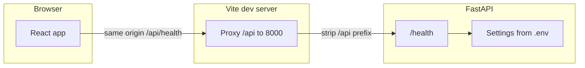

# Feature: kalshi-fullstack-setup
_Created: 2026-04-08_

---

## Goal

Scaffold a monorepo with a FastAPI backend (uv, Python 3.12) and a Bun + Vite + React TypeScript frontend, production Kalshi URLs and PEM-based credentials in env, Vite `/api` proxy with CORS only when opted in—without implementing Kalshi REST, WebSocket streaming, events, or orders.

---

## Requirements

### Problem Statement

The repository needed a fullstack foundation before any Kalshi market or trading logic, with secrets confined to the backend and production-grade Kalshi endpoints documented from official docs.

### Goals

- `backend/` FastAPI app with configurable Kalshi settings and a simple health endpoint
- `frontend/` React TS via Vite, Bun for package management and scripts
- `backend/.env.example` using **production** Kalshi REST and WebSocket URLs only (no demo defaults)
- Private key supplied as **PEM in environment** (escaped newlines in `.env`)
- Dev ergonomics: Vite proxies `/api` to FastAPI on port 8000; CORS middleware omitted unless `CORS_ALLOWED_ORIGINS` is set
- Root `README.md` with run and verification instructions

### Non-Goals

- Docker, docker-compose, CI
- Calling Kalshi REST or WebSocket from code
- Order placement, event listing, or real-time UI beyond connectivity smoke test

### User Stories

- As a developer, I can copy `.env.example`, fill Kalshi production credentials, run the API and the Vite app, and see `/api/health` succeed through the proxy.

### Success Criteria

- `uv run serve` starts FastAPI on `127.0.0.1:8000`
- `bun dev` serves the frontend and successfully fetches `/api/health` via proxy
- `bun run build` and `bun run lint` pass
- No secrets committed; `.env` gitignored

### Constraints & Assumptions

- Python 3.12+, uv for dependencies
- Kalshi auth uses RSA-PSS-SHA256 signing per [API keys](https://docs.kalshi.com/getting_started/api_keys); signing will be implemented later using `cryptography` already declared
- Production REST base includes `/trade-api/v2` per [quick start](https://docs.kalshi.com/getting_started/quick_start_authenticated_requests)

### Open Questions

- None for the scaffold; integration tasks will reference [llms.txt index](https://docs.kalshi.com/llms.txt) for endpoint details.

---

## Design

### Architecture Overview

### Components & Responsibilities

- **`backend/src/backend/settings.py`** — Pydantic settings: Kalshi URLs, key id, PEM, optional CORS list
- **`backend/src/backend/app.py`** — FastAPI app factory, conditional CORS, `/health`
- **`backend/src/backend/dev.py`** — `uv run serve` entry (uvicorn reload)
- **`frontend/vite.config.ts`** — `server.proxy` for `/api`
- **`frontend/src/App.tsx`** — Smoke test: fetch `/api/health`

### Data Models

- None beyond settings schema (no DB).

### API / Interface Contracts

- `GET /health` → `{ "status": "ok", "kalshi_credentials_configured": boolean }` (no secrets leaked)

### Tech Choices & Rationale

- **uv** — fast lockfile and Python 3.12 pin; user requested uv (Poetry not required for a second lockfile)
- **httpx / websockets / cryptography** — align with Kalshi docs and future REST + WS client code

### Security & Performance Considerations

- Private key only in server env; never in frontend bundles
- CORS disabled by default; proxy avoids browser cross-origin for local dev

### Design Decisions & Trade-offs

- **PEM in env** — `\n` escaping documented for `.env` one-line storage vs file path
- **Production-only defaults** — demo URLs omitted per product decision

### Non-Functional Requirements

- Clear README and `.env.example` comments linking official Kalshi documentation

---

## Planning

### Scope

- New files under `backend/`, `frontend/`, `docs/ai/features/`, root `README.md`, `.gitignore`

### Flow Analysis

- Developer starts API → starts Vite → browser loads React → `fetch('/api/health')` → Vite → FastAPI

### Task Breakdown

- [x] Step 1 — Initialize backend with uv (Python 3.12) and add FastAPI stack dependencies
  - Files: `backend/pyproject.toml`, `backend/uv.lock`, `backend/.python-version`
  - Action: `uv init`, `uv add` runtime libraries
  - Test criteria: `uv run python -c "import backend"` succeeds
- [x] Step 2 — Add settings module and FastAPI app with `/health` and optional CORS
  - Files: `backend/src/backend/settings.py`, `backend/src/backend/app.py`, `backend/src/backend/dev.py`, `backend/.env.example`
  - Action: Implement settings (production URLs, PEM handling), app factory, `serve` script
  - Test criteria: `uv run python -c "from backend.app import app"` lists `/health` route
- [x] Step 3 — Scaffold frontend with Bun + Vite React TS and `/api` proxy
  - Files: `frontend/vite.config.ts`, `frontend/src/App.tsx`, `frontend/src/App.css`
  - Action: `bun create vite`, configure proxy, minimal health fetch UI
  - Test criteria: `bun run build` succeeds
- [x] Step 4 — Repository docs and ignore rules
  - Files: `README.md`, `.gitignore`, `backend/README.md`, `docs/ai/features/kalshi-fullstack-setup.md`
  - Action: Document env vars, Kalshi doc links, run commands
  - Test criteria: New contributor can follow README without extra context

### Dependencies

- External: Bun, uv, Kalshi account API keys for full credential check (optional for `/health`)

### Effort Estimates

- Small (single session)

### Execution Order

- Backend deps → backend app → frontend scaffold → proxy → documentation

### Risks & Open Questions

- **Signing path quirks** — Kalshi requires signing `timestamp + METHOD + path` without query string; implementation phase must match each request path exactly ([quick start](https://docs.kalshi.com/getting_started/quick_start_authenticated_requests)).

---

## Implementation Notes

- `uv` was installed via official installer where missing; `serve` console script runs uvicorn with reload on `127.0.0.1:8000`
- WebSocket handshake uses the same headers as REST; WS sign string uses `GET` + `/trade-api/ws/v2` per [WebSocket quick start](https://docs.kalshi.com/getting_started/quick_start_websockets)

---

## Testing

### Unit Tests

- Deferred until business logic exists

### Integration Tests

- Manual: run API + Vite, confirm JSON from `/api/health`

### Coverage Targets

- N/A for scaffold

### Deferred Tests

- Kalshi API contract tests once HTTP signing and clients are implemented
