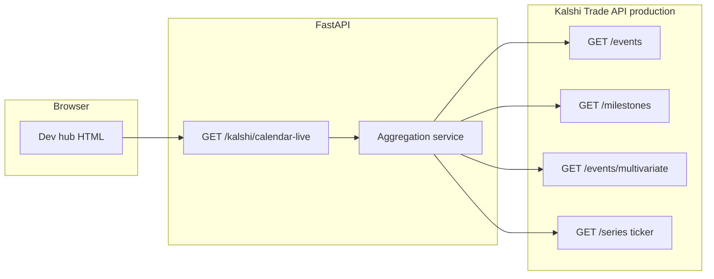

# Feature: kalshi-live-events
_Created: 2026-04-08_

---

## Goal

Expose up to **10** Kalshi **production** events that match the set shown under **LIVE** on [https://kalshi.com/calendar](https://kalshi.com/calendar), with **full nested market pricing and metadata**, via one **JSON API** on this backend plus a **dev hub table** on `http://127.0.0.1:8000/`, using authenticated Trade **REST** (and WebSocket only if it clearly improves accuracy for this snapshot use case).

---

## Requirements

### Problem Statement

You need to see which calendar-style “live” events are tradable, with enough market-level data to decide what to buy, without relying on the website alone. The website calendar is not a documented Trade API endpoint; we must **approximate** the same set using official APIs and **verify** against the calendar and known event URLs.

### Goals

- One **GET** JSON endpoint returning **at most 10** events, each with **event_ticker**, **title** (and key event fields), **kalshi_url**, and **markets** including **prices** (`yes_bid_dollars`, `yes_ask_dollars`, `last_price_dollars`, etc.) and other fields returned by Kalshi.
- **Production** Trade API only (`KALSHI_REST_BASE_URL` default).
- **Authenticated** requests (existing RSA-PSS signing).
- **Dev hub** HTML section (and/or dedicated dev page) showing the same data in a table for spot-checks.
- **Request visibility**: new routes appear in the existing dev **live request log** (`/dev/requests`, `/dev/api/requests`).
- **Spot-check** procedure documented: compare API output to 1–2 known pages (e.g. a known LIVE market URL vs a non-LIVE reference).

### Non-Goals

- Order placement, RFQ, or portfolio actions.
- Scraping `kalshi.com` HTML/JS as the primary data source (fragile; may be used only for **manual** comparison).
- Storing telemetry or writing JSON log files outside the feature doc (per project rules).

### User Stories

- As a developer, I can open `http://127.0.0.1:8000/`, follow a link to the new endpoint or dev table, and see up to 10 live calendar-aligned events with markets and prices.
- As a developer, I can confirm in `/dev/requests` that calls hit `/kalshi/...` when I load the hub or JSON.

### Success Criteria

- `GET /kalshi/...` (final path TBD) returns JSON with **≤10** events, each including **tickers**, **titles**, **Kalshi URLs**, and **nested markets with pricing fields** from the Trade API.
- Dev hub shows a readable table aligned with that JSON.
- Manual verification: titles/tickers for sampled rows match a **LIVE** row visible on `kalshi.com/calendar` and differ from a chosen **non-LIVE** example where expected.

### Constraints & Assumptions

- **Max 10 events** per response.
- Credentials present locally (`KALSHI_API_KEY_ID`, `KALSHI_PRIVATE_KEY_PEM`).
- `npx ai-devkit@latest codebase-scan` is **not** available in the current CLI (command missing); planning used manual repo review + Kalshi docs.

### Open Questions

- **Exact public URL shape**: Prefer deriving from API fields (`GET /series/{ticker}`, `product_metadata`) rather than hardcoding; confirm pattern `https://kalshi.com/markets/{series}/{slug}/{event_ticker}` during implementation.
- **Calendar parity**: Trade API does not expose a single “calendar LIVE” ID; implementation uses a **documented combination** of `GET /events`, `GET /milestones`, and optional `GET /events/multivariate`, then intersects/filters. Residual mismatch is acceptable if documented and spot-checked.

---

## Design

### Architecture Overview



### Components & Responsibilities

- **`backend/routers/kalshi.py`**: New route(s) delegating to aggregation logic.
- **`backend/kalshi/`** (new module e.g. `calendar_live.py`): Compose Kalshi GETs, cap at 10, shape response.
- **`backend/dev_console.py`**: Link + optional dedicated page with table populated from the same JSON (fetch from same-origin).

### Data Models

- Response is a **view model** (Pydantic or plain dict) wrapping Kalshi `EventData` + `Market[]` + derived `kalshi_url` string.
- No new database tables.

### API / Interface Contracts

- **Kalshi** (see [llms.txt](https://docs.kalshi.com/llms.txt)):
  - [Get Events](https://docs.kalshi.com/api-reference/events/get-events.md) — `status`, `with_nested_markets`, `with_milestones`, pagination.
  - [Get Multivariate Events](https://docs.kalshi.com/api-reference/events/get-multivariate-events.md) — `with_nested_markets`.
  - [Get Milestones](https://docs.kalshi.com/api-reference/milestone/get-milestones.md) — `limit` (required), `minimum_start_date`, filters.
  - [Get Series](https://docs.kalshi.com/api-reference/market/get-series.md) — optional slug/metadata for URLs.

### Tech Choices & Rationale

- Reuse existing **`kalshi_get`** and signing (query string excluded from signature per existing client).
- Prefer REST aggregation over WebSocket for this **bounded list**: WS channels ([Market & Event Lifecycle](https://docs.kalshi.com/websockets/market-&-event-lifecycle.md)) are better for **streaming** updates than first-load listing; optional follow-up if REST filtering is insufficient.

### Security & Performance Considerations

- Secrets remain server-side; browser only calls same-origin backend.
- Minimize sequential fan-out: batch where possible, cap **10** events, reasonable `limit` on list endpoints.

### Design Decisions & Trade-offs

- **Calendar source of truth**: Manual **visual** alignment with [kalshi.com/calendar](https://kalshi.com/calendar) **LIVE** section; technical source is Trade API **composition**, not HTML scraping.
- **Multivariate**: Included only if needed to match calendar rows; may be a small merge from `/events/multivariate` (user must approve shape — see example below).

### Non-Functional Requirements

- FastAPI route documented under OpenAPI **kalshi** tag.
- No `console.log` in production paths; dev hub may use inline script fetch only.

---

## Example: multivariate event (for approval)

Kalshi **multivariate** events are **combo** events from collections ([Get Multivariate Events](https://docs.kalshi.com/api-reference/events/get-multivariate-events.md)). They are **not** returned from `GET /events` (that endpoint **excludes** multivariate; docs specify using `/events/multivariate`).

Illustrative shape (field names from OpenAPI; **tickers are dynamic** and change over time):

```json
{
  "event_ticker": "KXMV…",
  "series_ticker": "KXMV…",
  "title": "Combined outcome example",
  "sub_title": "Short label",
  "mutually_exclusive": false,
  "markets": [
    {
      "ticker": "KXMV…-LEG1",
      "event_ticker": "KXMV…",
      "status": "active",
      "yes_bid_dollars": "0.4500",
      "yes_ask_dollars": "0.4700",
      "last_price_dollars": "0.4600",
      "mve_collection_ticker": "KXMV…",
      "mve_selected_legs": [
        {
          "event_ticker": "KXNBAGAME-…",
          "market_ticker": "KXNBAGAME-…-DEN",
          "side": "yes"
        }
      ]
    }
  ]
}
```

**Approve** including multivariate rows in the same JSON **if** they appear on the calendar LIVE strip; otherwise restrict to standard events only after you confirm.

---

## Planning

### Scope

| Area | Files (expected) |
|------|-------------------|
| Router | `backend/src/backend/routers/kalshi.py` |
| Kalshi logic | `backend/src/backend/kalshi/calendar_live.py` (new) |
| Dev hub | `backend/src/backend/dev_console.py` |
| Tests (optional) | `backend/tests/...` if present — **do not weaken tests** |

### Flow Analysis

1. Load candidate **event tickers** from:
   - `GET /milestones` (primary_event_tickers / related_event_tickers within a recent window), and/or
   - `GET /events?status=open&with_nested_markets=true` (+ pagination as needed), and/or
   - `GET /events/multivariate?with_nested_markets=true` (if approved).
2. De-duplicate tickers; fetch or retain **nested markets** with pricing.
3. Score/sort to prefer **calendar-like LIVE** (e.g. started milestone, open markets with `active` status, high recency).
4. **Slice to 10**; attach **kalshi_url** via series/metadata when possible.
5. Return JSON; dev hub fetches and renders.

### Task Breakdown

- [x] Step 1 — Add Kalshi calendar-live aggregation module
  - Files: `backend/src/backend/kalshi/calendar_live.py`, `backend/src/backend/kalshi/__init__.py` (exports if needed)
  - Action: Implement typed functions that call `kalshi_get` for `/milestones`, `/events`, `/events/multivariate` (optional branch), merge ticker sets, load nested markets, sort, cap **10**, build `kalshi_url` helper (series lookup optional).
  - Test criteria: Unit-level or manual: function returns ≤10 items; raises clear HTTP errors on Kalshi 4xx/5xx mapping.

- [x] Step 2 — Expose `GET /kalshi/calendar-live` (name finalized in code)
  - Files: `backend/src/backend/routers/kalshi.py`
  - Action: New route calling aggregation module; OpenAPI description; same credential guard as existing routes.
  - Test criteria: `curl` with valid env returns JSON; `/dev/requests` shows the request when hit.

- [x] Step 3 — Dev hub: links + live table page
  - Files: `backend/src/backend/dev_console.py`
  - Action: Add Kalshi section link to JSON endpoint; new small HTML page (e.g. `/dev/kalshi-calendar-live`) that `fetch`es the JSON and renders a table (event + markets + key prices).
  - Test criteria: Open `http://127.0.0.1:8000/` → new link → table shows same data as JSON; request log records `GET /kalshi/...` and `GET /dev/...`.

- [x] Step 4 — Verification and spot-check checklist
  - Files: `docs/ai/features/kalshi-live-events.md` → Implementation Notes
  - Action: Record 1–2 spot-checks (LIVE vs non-LIVE URLs) and note comparison to `kalshi.com/calendar` LIVE list; run backend lint/tests if configured.
  - Test criteria: Checklist filled; CI commands pass.

### Dependencies

- Kalshi production connectivity and valid API key.
- Existing `kalshi_get` helper.

### Effort Estimates

- Step 1: M
- Step 2: S
- Step 3: M
- Step 4: S

### Execution Order

1 → 2 → 3 → 4

### Risks & Open Questions

- **Parity risk**: Milestone- and event-based filters may not match the website’s internal ranking for “LIVE · N”. Mitigation: document heuristic; user spot-checks calendar.
- **Rate limits**: Multiple calls; keep limits modest and cache within request only.
- **URL slugs**: If series slug unavailable, fall back to a documented URL template or `https://kalshi.com` search — **must not** invent tickers.

> **Research:** Kalshi recommends combining REST with WebSocket for freshest state ([Get User Data Timestamp](https://docs.kalshi.com/api-reference/exchange/get-user-data-timestamp.md) in index); for a **list snapshot**, REST + cap 10 is usually sufficient.

---

## Implementation Notes

- **Endpoint:** `GET /kalshi/calendar-live` — aggregates `GET /events` (`status=open`, `with_nested_markets=true`), `GET /events/multivariate` (`with_nested_markets=true`), and `GET /milestones` (recent window) for scoring; each list follows **up to two** cursor pages (caps API fan-out). **Scoring:** tiered milestone boosts (**primary_live** > **related_live** > **primary_all** > **related_all**); “live” uses **`start_date` ≤ now** and **`end_date`** absent, **≥ now**, or within an **8h grace** after end. **Volume** contributes at most **75k** per event; **one** +50k if **any** market is `active`. Tickers in **`primary_live`** but missing from the paged open/MV lists are **hydrated** via parallel `GET /events/{ticker}` (cap 40). Sort tie-break: **`last_updated_ts`** desc, then ticker. Initial `asyncio.gather` uses **`return_exceptions=True`**. If both list endpoints are empty, fetches individual events for milestone tickers (fallback). **Series** for the selected ten: **`asyncio.gather`**.
- **Dev UI:** `GET /dev/kalshi-calendar-live` — client-side fetch of `/kalshi/calendar-live`; builds DOM with `textContent` only (no `innerHTML`).
- **Public URL:** `build_kalshi_markets_url` uses `product_metadata` slug hints plus `GET /series/{ticker}` metadata when available; otherwise two-segment `https://kalshi.com/markets/{series}/{event_ticker}`.
- **Spot-check (manual):** With credentials, open `http://127.0.0.1:8000/dev/kalshi-calendar-live` and compare titles to [kalshi.com/calendar](https://kalshi.com/calendar) LIVE strip; compare a non-LIVE example (e.g. PGA Masters-style page) when it does not appear in the top 10.

---

## Testing

### Unit Tests

- Pure helpers for URL building and ticker de-duplication (if extracted).

### Integration Tests

- Optional mocked `httpx` responses for aggregation (if test suite exists).

### Coverage Targets

- Best-effort; no test weakening.

### Deferred Tests

- Live Kalshi E2E in CI (no credentials in CI by default).
