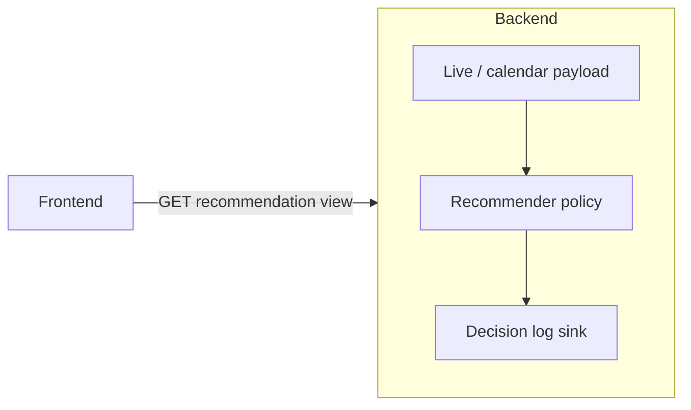

# Feature: live-sports-market-recommender
_Created: 2026-04-11_

---

## Goal

Scaffold a **configurable policy** that, for each **live sports game**, ranks markets by **last price**, takes the **top 3**, and emits a **binary buy signal (yes/no)** per market using **thresholds and progress rules** (initially: game more than halfway done **and** last price above a cent threshold). Persist **structured rows** for later **offline ML** without blocking iteration on model quality.

---

## Requirements

### Problem Statement

Need a repeatable hook between **live Kalshi sports state** (progress, prices) and **actionable signals**, with **experiment-friendly parameters** and **durable telemetry** for future training.

### Goals

- Binary **recommendation per market** (and/or per game aggregate — see open questions).
- **Top-N by last price** (default N=3) as input slice before rules.
- **Parameterized rules** (half-time/progress fraction, min last price in cents, N) loaded from config/env — not hardcoded in UI.
- **Append-only or upsert logging** of inputs + decision + policy version for ML pipelines.

### Non-Goals (scaffold)

- Training or serving an ML model in production.
- Automatic order placement (unless explicitly added later with risk controls).
- Guaranteeing edge or profitability.

### User Stories

- As a trader, I see **yes/no** per candidate market on live sports so I can decide faster.
- As an experimenter, I change **thresholds** without redeploying frontend logic.
- As a data owner, I export **historical feature rows** aligned with outcomes for offline learning.

### Success Criteria

- Single documented **policy version** string in every log row.
- End-to-end path: **live sports snapshot → recommender → response + log line** in dev.
- Frontend can **display** signals only; **no** silent swallow of errors in the recommender path (surface HTTP errors; structured logger on server).

### Constraints & Assumptions

- Kalshi **last price** and **game progress** must come from existing or extended backend integrations (not guessed in browser).
- Rate limits and polling intervals respected; recommender should be **cheap** (pure function over already-fetched snapshot where possible).

### Open Questions

See **Planning → Risks & Open Questions** and clarifications from product owner.

---

## Design

### Architecture Overview

**Place the recommender in the backend** for the scaffold.

| Option | Verdict |
|--------|---------|
| **Frontend** | Poor: hides strategy in bundle, no durable unified log, weak place for secrets if execution added later. OK only for **display** of server-computed signals. |
| **Backend (FastAPI)** | **Default:** reuse Kalshi HTTP client, live/sports modules, settings, structured logging, single deployment. |
| **Standalone service** | Defer until separate scaling, multi-consumer API, or heavy async ML — adds network/OAuth/deploy surface for little benefit at scaffold. |

### Components & Responsibilities

- **Policy module**: pure functions `(snapshot row, params) -> { market_ticker, buy: bool, reasons: string[] }[]`.
- **Params**: Pydantic settings or JSON config — `min_last_price_cents`, `min_progress`, `top_n`, `policy_id`.
- **Instrumentation**: structured log per evaluation (no PII; tickers/ids only).

### Data Models

- **Decision record (conceptual)**: `ts`, `policy_version`, `event_ticker`, `market_ticker`, `last_price_cents`, `progress_estimate`, `top_n_rank`, `buy`, `rule_hits` (booleans or codes).

### API / Interface Contracts

- TBD: dedicated `GET /kalshi/.../recommendations` **or** embedded fields on existing live payload — see clarifications.

### Tech Choices & Rationale

- Python next to existing Kalshi code; same `uv` toolchain; easy CSV/Parquet export later.

### Security & Performance Considerations

- Read-only to external APIs in scaffold; any write/trade path needs auth and idempotency (out of scope unless requested).
- Recommender must avoid N+1 Kalshi calls if inputs already in snapshot.

### Design Decisions & Trade-offs

- **Backend-first** trades operational simplicity for less isolation than a microservice — acceptable for scaffold.

### Non-Functional Requirements

- Observable: errors logged with context; no silent `except: pass` in recommender code paths.

---

## Planning

### Scope

- New backend module(s) under `backend/src/backend/...` for policy + types.
- Optional route returning recommendations for live sports subset.
- Optional minimal UI strip in explorer or dev page — only if agreed (may stay API-only for scaffold).

### Flow Analysis

1. Ingest live sports event + markets with **last_price** and **progress** (or proxy).
2. Sort markets by last price desc, take top N.
3. Apply rule chain → binary per market.
4. Emit response + append log record.

### Task Breakdown

- [ ] Step 1 — Define policy types and default parameters (env/settings).
  - Files: `backend/src/backend/settings.py` (if new fields), new `recommender` module.
  - Action: Pydantic models for params + output; default policy id string.
  - Test criteria: `uv run python -c` import smoke; unit test on pure function with fake snapshot optional.

- [ ] Step 2 — Implement pure `evaluate_recommendations(snapshot, params)`.
  - Files: recommender module.
  - Action: top-N by last price; progress + price gates; return list with reasons.
  - Test criteria: table-driven tests for edge cases (empty markets, tie prices, missing progress).

- [ ] Step 3 — Wire HTTP surface (shape TBD after clarifications).
  - Files: `kalshi` router or live router.
  - Action: return JSON with recommendations + policy version.
  - Test criteria: curl/local dev returns 200 with schema.

- [ ] Step 4 — Logging sink stub (stdout structured JSON or SQLite/file — TBD).
  - Files: recommender or logging helper.
  - Action: one line per market decision with policy_version.
  - Test criteria: log line visible when endpoint called.

- [ ] Step 5 — Frontend display (optional).
  - Files: TBD.
  - Action: show buy/no per row.
  - Test criteria: `bun run check` passes.

### Dependencies

- Accurate **progress** signal for “halfway done” (clock, period, Kalshi milestone fields — must align with existing `sports_live` / live data).

### Effort Estimates

- Scaffold (backend only): small (0.5–1.5 days) depending on progress signal clarity and logging choice.

### Execution Order

Steps 1–4 in order; Step 5 optional.

### Risks & Open Questions

- **Progress definition**: wall-clock vs sport-specific (soccer halves vs basketball quarters).
- **Top 3**: per **event** or per **multivariate** parent — ambiguity for Kalshi structure.
- **Binary scope**: per market vs single “buy best of top 3” — affects logging schema.
- **Outcome labels for ML**: need settlement data later — not in scaffold but schema should leave hooks.

---

## Implementation Notes

_Populated during execution_

---

## Testing

### Unit Tests

- Policy function: thresholds, ties, missing data.

### Integration Tests

- Optional: router test with mocked live payload.

### Coverage Targets

- Scaffold: critical paths in policy module only.

### Deferred Tests

- E2E against real Kalshi in CI.

---

## Ralph intake — answer in chat

See user reply block in conversation for clarifying questions.
