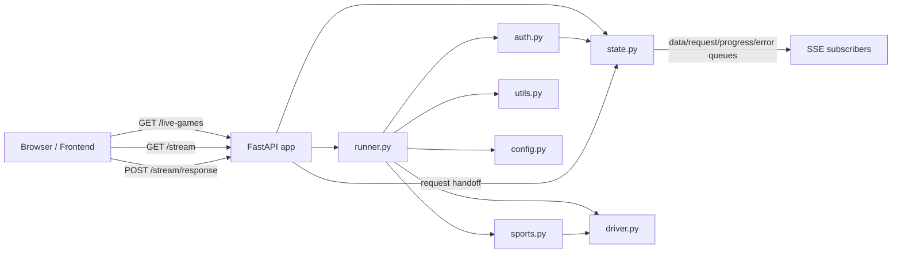

# Backend Overview

## Goal
Document how the backend works end to end so the app structure, API surface, and runtime flow are easy to understand and extend.

## Backend Map

### Runtime
- Python backend under `backend/src`
- FastAPI app served through `backend/scripts/serve.py`
- Selenium Chrome driver used to log in, navigate, and scrape live markets
- Shared state and SSE queue handling live in `backend/src/state.py`

### Core Modules
- `backend/src/app.py` - FastAPI application, SSE stream, response endpoint, lifecycle hooks
- `backend/src/runner.py` - Orchestrates browser startup, login, sports navigation, polling, and payload emission
- `backend/src/auth.py` - Login and verification flow, including SSE-assisted 2FA handling
- `backend/src/sports.py` - Scrapes live market tiles into structured game records
- `backend/src/driver.py` - Builds the Selenium Chrome WebDriver
- `backend/src/config.py` - Loads environment config from repo root `.env`
- `backend/src/state.py` - Latest payload cache, SSE queues, request/response handoff, progress/error events
- `backend/src/utils.py` - Small timing helper used to add latency between actions

## API Surface

### `GET /live-games`
Returns the latest scraped payload.

Response shape:
```json
{
  "updated_utc": "2026-03-25T12:34:56Z",
  "games": []
}
```

Behavior:
- Returns `{ "updated_utc": null, "games": [] }` before the first successful scrape
- Returns the latest in-memory payload after the runner publishes one

### `GET /stream`
Server-Sent Events endpoint for live updates.

Event types:
- `data` - full payload snapshots from `state.set_latest`
- `request` - user input required by the runner, usually 2FA or verification
- `progress` - progress updates as percentages
- `error` - terminal or recoverable error events
- keepalive comment frames every 30 seconds if idle

Request event shape:
```json
{
  "request_id": "uuid",
  "prompt": "Enter 2FA or verification code",
  "field": "code"
}
```

### `POST /stream/response`
Accepts user input for a pending request and unblocks the waiting runner.

Request body:
```json
{
  "request_id": "uuid",
  "value": "123456"
}
```

Response:
```json
{ "ok": true }
```

Errors:
- `404` if the `request_id` is unknown

## Environment

Loaded from repo root `.env` by `backend/src/config.py`.

Known variables:
- `KALSHI_PUBLIC_URL` - **Kalshi website** root for Selenium (not the Predict API). Legacy: `BASE_URL` if unset; default `https://kalshi.com`
- `PUBLIC_API_BASE_URL` - used by the **frontend only**; origin of this FastAPI app (not Kalshi)
- `KALSHI_EMAIL` - login email
- `KALSHI_PASSWORD` - login password
- `ENV` - when set to `prod`, the browser runs headless
- `IS_CONTAINER` - enables container-safe Chrome flags
- `LATENCY_MS` - upper bound for randomized action delay
- `VERIFY_WAIT_TIMEOUT` - wait time for returning to the site after login/verification
- `LIVE_GAMES_POLL_SEC` - poll interval for live market refreshes
- `PORT` - **this FastAPI process** listen port (`serve.py`), not Kalshi’s hostname

## Mermaid



## Flow

1. `backend/scripts/serve.py` adds `backend/` and `backend/src/` to `sys.path`, imports the FastAPI app, and starts `uvicorn`.
2. On startup, `backend/src/app.py` starts the runner in a daemon thread.
3. The runner opens the site, logs in, navigates to the sports page, waits for market tiles, then polls live games.
4. Each scrape updates `state.latest_payload` and emits `data` events to all SSE subscribers.
5. If login or verification needs user input, the runner enqueues a `request` event and waits for `POST /stream/response`.
6. The frontend can read snapshots via `GET /live-games` or subscribe to `GET /stream` for live updates.

## Module Notes

### `state.py`
- Owns the shared payload cache and queue list
- Converts domain events into queue items (`DataItem`, `RequestItem`, `ProgressItem`, `ErrorItem`)
- Bridges the runner and browser clients through SSE

### `auth.py`
- Handles the sign-in workflow with XPath selectors
- Supports a verification fallback and an SSE-assisted 2FA path
- Reports progress and errors through `state`

### `sports.py`
- Scrapes live market tile data from the sports page
- Builds the `games` payload consumed by the frontend

### `runner.py`
- Orchestrates the full session lifecycle
- Publishes payloads every `LIVE_GAMES_POLL_SEC`
- Handles shutdown cleanly by quitting the browser

## Setup

Backend install and run:
```bash
cd backend
python3 -m pip install -r requirements.txt
python3 scripts/serve.py
```

Repo convenience launcher:
```bash
./run.sh
```

## Notes

- The backend is stateful in memory; a restart clears the latest payload and any pending request state.
- `backend/README.md` currently just marks the backend folder as reserved, so this file is the canonical backend map.
- The `frontend/` app is separate and consumes the backend API rather than sharing code with it.