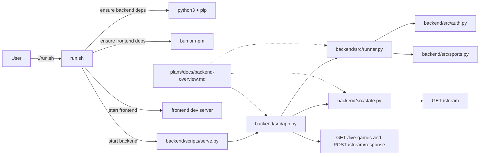

# Run Script Orchestration Plan

## Goal
Document how `run.sh` wires the frontend and backend together, and connect it to the backend architecture notes so the launch path is easy to understand.

## Scope

- `run.sh` - local orchestration for backend and frontend startup
- `README.md` - repo entry point and setup directions
- `plans/docs/backend-overview.md` - backend API and runtime map
- `plans/README.md` - plans index

Out of scope:
- Changing backend behavior
- Changing frontend behavior
- Adding production deployment logic

## Flow Analysis

### User Flow
1. A user runs `./run.sh` from the repo root.
2. The script prints the local backend and frontend URLs.
3. It checks Python dependencies for the backend and installs them if needed.
4. It checks frontend dependencies and installs them with Bun or npm.
5. It starts the backend via `backend/scripts/serve.py`.
6. It starts the frontend dev server via `frontend` scripts.
7. Both processes remain attached until the user stops the script.

### Runtime Concerns
- The backend must be started from the `backend/` directory so `scripts/serve.py` can resolve the app source.
- The frontend must be started from the `frontend/` directory so Vite resolves the SvelteKit app correctly.
- The script currently assumes Python 3, `pip`, and either Bun or npm are available.
- The script traps `INT` and `TERM` so it can stop both services together.

## Mermaid

## Documentation Map

- `README.md` explains the repo layout and tells you where the backend API lives.
- `plans/docs/backend-overview.md` explains the backend modules, environment variables, API endpoints, and runtime flow.
- This file explains how `run.sh` launches those components together.

## Execution Notes

- `run.sh` is the local development entry point, not the backend source of truth.
- The backend overview doc should stay aligned with `backend/src/app.py`, `backend/src/runner.py`, and `backend/src/state.py`.
- If `run.sh` changes, update this document and the backend overview together.

## Open Questions

- Should `run.sh` keep using `python3 -m pip install` or should the backend eventually switch to a pinned environment manager?
- Should the script wait for the backend health check before launching the frontend?
- Should the plans index grow a separate launch section for operational scripts like this one?