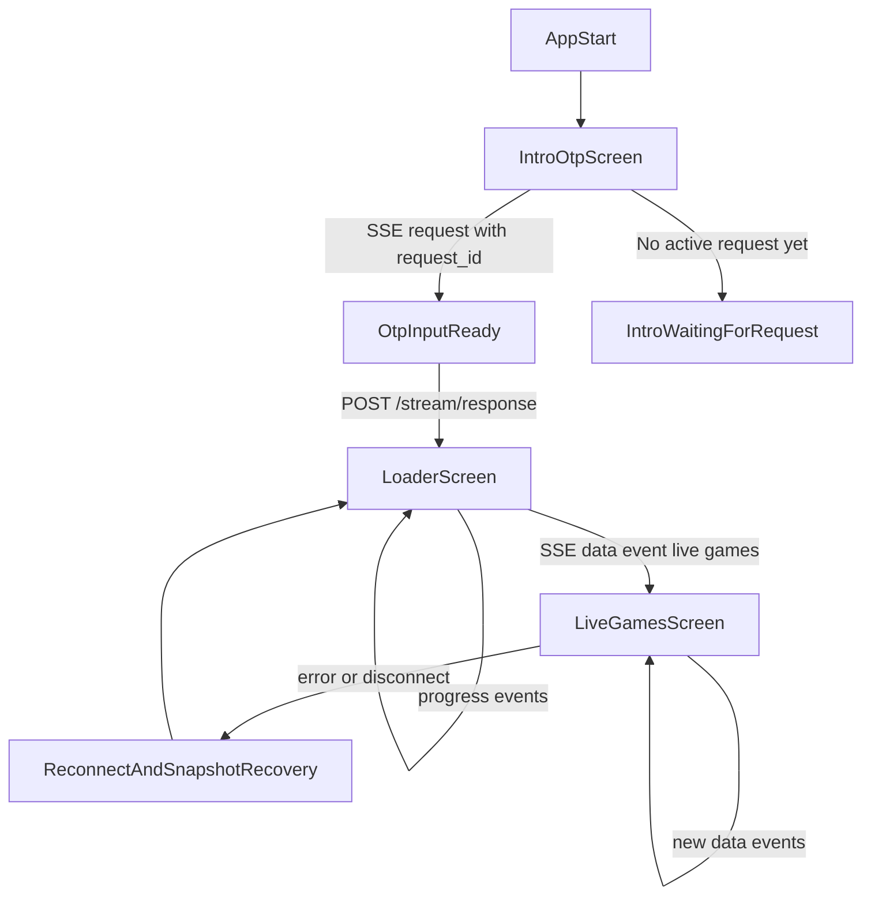

# Frontend / Backend API Connection Plan

## Planning (status)

**Next steps:** Run §10 manual / QA against a live backend; optionally add focused unit tests for SSE JSON parsing and `submitStreamResponse` 404 handling.

**Done:** Repo-root `.env.example`, `.env` required by `run.sh` and `backend/scripts/serve.py`, `run.sh` backend-first + curl readiness + `PUBLIC_API_BASE_URL`, SvelteKit `envDir: '..'` for one root `.env`, frontend lib layer (`streamTypes`, `sseConnection`, `liveGamesApi`, `streamResponse`), `+page.svelte` state machine, `into.svelte` four-digit auto-submit, `app.css`, backend OTP replay via `state._unresolved_request` + `clear_unresolved_if_match`, stream `RequestItem` cleanup `try`/`finally` + cancel pending future on disconnect.

**Deferred / product:** Explicit exponential backoff for transport disconnects is left to browser `EventSource` retry plus user **Reconnect** after SSE `error` events; no polling loop beyond snapshot on reconnect.

## Objective

Build an implementation-ready sequence for the frontend around the **current backend contract** so app startup always begins at the OTP intro, then moves to the loader, then to live games as backend data arrives. This document is the single ordered checklist from initialization through live games.

## Confirmed backend contract (ground truth)

| Concern | Location | Contract |
|--------|----------|----------|
| SSE stream | `backend/src/app.py` — `GET /stream` | Events: `request`, `progress`, `data`, `error` |
| OTP submit | `backend/src/app.py` — `POST /stream/response` | Body: `{ request_id, value }` |
| Snapshot fallback | `backend/src/app.py` — `GET /live-games` | Bootstrap / recovery |
| OTP queue | `backend/src/state.py` | Requests queued in-memory |

No new endpoints are assumed; implementation must match this contract as-is.

## Goal (summary)

Map these APIs onto a three-screen frontend flow so the Svelte app shows OTP intro, loading state, then live games, with SSE as the primary realtime channel and `GET /live-games` for bootstrap and recovery.

## Scope

In scope:

- `backend/src/app.py` — API and SSE contract consumed by the frontend
- `backend/src/state.py` — event shapes; OTP replay compatibility for refresh (see implementation todos)
- `backend/src/auth.py` — source of OTP/verification `request` events
- `backend/src/sports.py` — source of live games payload for the home screen
- `frontend/src/routes/+page.svelte` — single-route screen state controller
- `frontend/src/routes/into.svelte` — intro / OTP UI component
- `frontend/src/routes/+layout.svelte` — shared app shell and global styles import
- `frontend/src/lib/*` — typed client helpers (SSE, OTP submit, snapshot); shared event/data types (no barrel `index.ts` per project rules)
- `frontend/src/app.css` — styling for intro, loader, live games
- `run.sh` — canonical startup: backend first, readiness wait, frontend with `PUBLIC_API_BASE_URL`
- `.env.example` — template for all required keys; users copy to `.env`

**App shell (navigation / header):** Responsive app chrome lives in `frontend/src/lib/components/AppHeader.svelte` with helpers under `frontend/src/lib/constants/`, `interfaces/`, and `utils/` (tabs, theme, media queries). Behavior and breakpoints are summarized in **`docs/frontend-conventions.md`**; compact menu icons live in **`frontend/static/icons/`** (`menu.png`, `menu-dark.png`).

Out of scope:

- Adding new backend endpoints
- Replacing SSE with WebSockets or polling-only architecture
- Persisting auth/session beyond current in-memory backend flow
- Changing backend login or scraping behavior except explicit compatibility fixes below

## Flow to implement



## API reference (frontend consumption)

### `GET /stream`

- Open **one** SSE connection on app mount.
- Parse event types into a shared frontend model.
- Mapping: `request` → intro/OTP; `progress` → loader; `data` → live games; `error` → recoverable error / reconnect path.

### `POST /stream/response`

- Body: `{ request_id, value }`.
- Keep SSE open after submit.
- **404**: treat as stale — clear local pending `request_id`, wait for next `request` event.
- **New `request_id` while OTP visible**: replace prompt/input with the newest request.

### `GET /live-games`

- Fetch after SSE is established for **bootstrap and recovery** (reconnect, error recovery). Minimum contract: snapshot + SSE recovery; optional periodic polling is a **product decision** once the stream is stable (see Open questions).
- After OTP, **do not** transition from loader to live games on snapshot alone — wait for **SSE `data`** with live games.
- Expected shape: `updated_utc` (ISO or `null`), `games` (array, possibly empty).

## Implementation checklist (ordered)

Use this section as the authoritative todo list. Complete in order unless noted.

### 1. Bootstrap env and runtime contract

- [x] Require `.env` before first run; document copying from `.env.example`.
- [x] Document one frontend API base: `PUBLIC_API_BASE_URL` (browser → backend).
- [x] Document backend credentials and tuning vars (see `.env.example` below).
- [x] Document that **`run.sh` is the canonical startup path** for local full stack.

**Validation**

- [x] A new developer can follow docs and create `.env` from `.env.example` without guessing variable names.
- [x] `PUBLIC_API_BASE_URL` is documented as the only browser-facing backend base the frontend uses.

### 2. Create `.env.example` with all required user-provided keys

- [x] Add file at repo root with at least:

```dotenv
# Kalshi site (Selenium) — not the Predict API
KALSHI_PUBLIC_URL=https://kalshi.com
KALSHI_EMAIL=
KALSHI_PASSWORD=

PORT=8000
PUBLIC_API_BASE_URL=http://localhost:8000
# … plus ENV, tuning vars; see repo .env.example
```

- [x] Note in README or plan: copy to `.env` and fill secrets locally; never commit `.env`.

**Validation**

- [x] `.env.example` exists at repo root and lists every key the backend and `run.sh` expect for local full stack.
- [x] Copying to `.env` and filling placeholders allows backend and frontend to start without missing-env failures.

### 3. Update `run.sh` (plan requirements)

- [x] Startup order: start **backend first**.
- [x] Wait for backend readiness (loop on `GET /live-games` or equivalent health until success).
- [x] Start frontend with `PUBLIC_API_BASE_URL` exported (or passed) so the client targets the correct backend.
- [x] Keep existing dependency bootstrap if present; on readiness **timeout**, exit non-zero with **clear stderr** message.

**Validation**

- [x] From a clean shell, `./run.sh` starts backend before frontend and frontend receives correct `PUBLIC_API_BASE_URL`.
- [x] Stopping the backend and re-running shows readiness wait; killing backend mid-wait eventually hits timeout with a clear stderr message (if timeout is implemented).

### 4. Define frontend API / client layer first (`frontend/src/lib/`)

- [x] SSE: connect, parse events, lifecycle (close on unmount / single subscription).
- [x] `POST /stream/response` helper with typed body and error handling (including 404 stale path).
- [x] `GET /live-games` snapshot fetch with shared response types.
- [x] Shared TypeScript types for stream events and game payload — **no new endpoint assumptions**.

**Validation**

- [ ] Unit or manual check: parsed SSE payloads map to typed events for `request`, `progress`, `data`, `error`.
- [x] OTP helper returns distinct handling for success vs **404** (stale request).
- [x] Snapshot helper parses `updated_utc` and `games` without runtime type surprises.

### 5. App state machine (single route: `+page.svelte`)

- [x] States: `intro`, `loader`, `liveGames`, `error` (or equivalent naming consistent with code).
- [x] On mount: open SSE immediately; fetch snapshot once for bootstrap/recovery; default visible screen is **intro** (waiting or OTP ready per events).
- [x] Transition rules: avoid flicker when snapshot has data but intro must show first — document explicit rule (e.g. intro takes precedence until OTP resolved or no pending auth, then loader until SSE `data`).

**Validation**

- [ ] On load, only one SSE connection is active (verify in Network tab or dev hook).
- [x] State matches screen: intro / loader / live games / error are mutually consistent with events.
- [x] Snapshot fetch does not skip intro when a pending OTP is still required.

### 6. OTP survives refresh (backend + frontend)

**Backend (compatibility):**

- [x] Keep **one** unresolved active OTP `request` **replayable** for newly connected SSE clients.
- [x] If a newer request is emitted, invalidate/replace the older unresolved request.

**Frontend:**

- [x] On submit **404**: clear local pending request; wait for next `request` event.
- [x] On new `request_id` while input visible: replace UI with newest request.

**Validation**

- [ ] Refresh mid-OTP: SSE reconnect shows the same unresolved request (or replaced newest request per backend rules).
- [ ] Submit with stale id → 404 path clears local pending id and next `request` repopulates the form.
- [ ] Two rapid requests from backend: UI always shows the latest `request_id`.

### 7. Intro / OTP UI

- [x] Implement or wire `frontend/src/routes/into.svelte` from `+page.svelte`.
- [x] Bind prompt, `request_id`, optional `field` from `request` event.
- [x] When the OTP field contains **four digits**, automatically `POST /stream/response` (no separate submit step required unless you add an optional confirm — default is auto-send on fourth digit).
- [x] While the OTP request is in flight, ignore duplicate auto-submits or block input per UX choice; on success → **loader**.

### 8. Loader screen

- [x] Enter immediately after the OTP `POST` succeeds (or when flow is progress-only without OTP, per state rules).
- [x] Stay on the loader until **SSE `data`** delivers live games from the backend — **not** solely because `GET /live-games` returned rows.
- [x] Still show `progress` on the loader when those events arrive.
- [x] Reserve hooks for animation; no animation implementation required in first pass.

**Validation**

- [ ] Entering four digits triggers exactly one submit with correct `request_id` and value; UI switches to loader without an extra click.
- [ ] If snapshot returns games before SSE `data`, loader remains until `data` arrives.
- [ ] After `data`, live games screen shows content consistent with that event.

### 9. Live games screen

- [x] Render games entirely from backend payload (snapshot + latest SSE `data`).
- [x] Keep subscribed to SSE `data` updates.
- [x] On disconnect: reconnect with backoff; refresh via `GET /live-games` (browser `EventSource` retry + user **Reconnect**; snapshot on reconnect when already on live games).
- [x] **Avoid duplicate SSE subscriptions** on reconnect (single connection or explicit teardown before new connect).

**Validation**

- [ ] Live games list updates in place when a second SSE `data` event arrives.
- [ ] Simulated SSE drop: reconnect uses backoff; `GET /live-games` refresh runs as recovery aid without spawning duplicate streams.
- [ ] Games render only from backend-shaped payload (no client-invented fields).

### 10. End-to-end validation (manual / QA)

Cross-cutting checks in addition to per-step validation above:

- [ ] **Startup**: `run.sh` → when backend emits `request`, intro OTP is visible.
- [ ] **Refresh**: unresolved OTP still visible after refresh; four-digit auto-submit still works.
- [ ] **Replacement**: backend issues newer request → old OTP replaced in UI.
- [ ] **Progress**: loader reflects `progress` events before `data`.
- [ ] **SSE-first exit from loader**: transition to live games coincides with SSE `data`, not snapshot alone.

## Constraints

- Backend contract unchanged unless a documented compatibility fix is required (e.g. OTP replay).
- One SSE connection per session; no duplicate subscriptions after reconnect logic.
- Single-page state machine on `+page.svelte` unless routing is explicitly added later.
- Preserve CORS for local dev (frontend port ≠ backend port).
- Home/live games resilient to empty payloads and delayed startup.

## Risks to track

- OTP replay for refresh is implemented in §6 backend state; multi-tab duplicate `_request_map` entries remain a known limitation (single SSE per session assumed).
- Showing intro first while supporting snapshot-first data needs **explicit transition rules** to avoid flicker.
- SSE disconnect handling must **not** create duplicate stream subscriptions.

## Open questions and decided behavior

1. **Refresh once the stream is stable:** Use **SSE-only** when stable — exact policy is a **product decision**. **Minimum** implementation remains: snapshot fetch + SSE for recovery and bootstrap (no requirement to add polling until product asks for it).

2. **OTP → loader → live games (decided):** Detect when **four digits** are entered; then send the OTP to the backend and switch to the **loader**. Stay on the loader until **live games arrive via SSE** (`data` event). Do not leave the loader for live games based on `GET /live-games` alone after OTP in this flow.

## Definition of done (for this plan document)

This plan doc is “done” when:

- It contains the **ordered checklist** from env/bootstrap through live games (this file).
- It specifies **`.env.example`** contents and exact **`run.sh`** behaviors.
- It specifies **refresh-safe OTP** lifecycle and **stale/new request** rules tied to existing APIs.

Implementation of the codebase is complete when all checklist items above are checked in development, **each step’s Validation subsection passes**, and §10 end-to-end checks pass.
